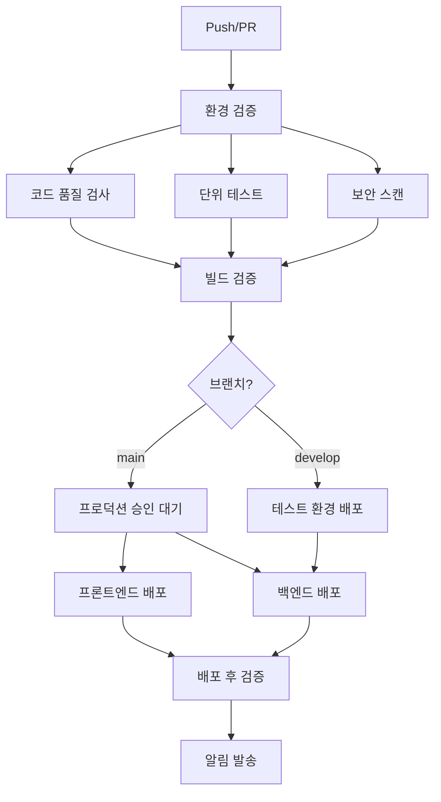

# GitHub Actions CI/CD 설정 가이드

이 문서는 Hanbit TODO 앱의 GitHub Actions CI/CD 파이프라인 설정 방법을 안내합니다.

## 📋 목차

- [워크플로우 개요](#워크플로우-개요)
- [필수 설정](#필수-설정)
- [환경별 배포](#환경별-배포)
- [보안 설정](#보안-설정)
- [트러블슈팅](#트러블슈팅)

## 🚀 워크플로우 개요

### 메인 CI/CD 파이프라인 (`ci-cd.yml`)



### 추가 워크플로우

- **`security.yml`**: 주기적 보안 스캔 (매주 월요일)
- **`cleanup.yml`**: 저장소 정리 (매주 일요일)

## ⚙️ 필수 설정

### 1. GitHub Secrets 설정

Repository Settings > Secrets and variables > Actions에서 다음 시크릿을 설정하세요:

#### AWS 관련

```
AWS_ACCESS_KEY_ID          # AWS 액세스 키 ID
AWS_SECRET_ACCESS_KEY      # AWS 시크릿 액세스 키
AWS_DEFAULT_REGION         # AWS 기본 리전 (예: us-east-1)
AWS_ACCOUNT_ID            # AWS 계정 ID
AWS_DEPLOYMENT_ROLE_ARN   # 배포용 IAM 역할 ARN (선택사항)
```

#### 애플리케이션 관련

```
VITE_API_URL              # 프론트엔드용 API URL
```

#### 알림 관련 (선택사항)

```
SLACK_WEBHOOK_URL         # Slack 웹훅 URL
DISCORD_WEBHOOK           # Discord 웹훅 URL
```

### 2. GitHub Variables 설정

Repository Settings > Secrets and variables > Actions > Variables에서 다음을 설정하세요:

```
AWS_DEFAULT_REGION        # AWS 기본 리전 (기본값: us-east-1)
```

### 3. GitHub 환경 설정

Repository Settings > Environments에서 다음 환경을 생성하세요:

- **`prod`**: 프로덕션 환경
- **`test`**: 테스트 환경
- **`production-approval`**: 프로덕션 배포 승인
- **`github-pages`**: GitHub Pages 배포

각 환경 설정은 `.github/environments/` 폴더의 YAML 파일을 참조하세요.

## 🌍 환경별 배포

### 개발 환경 (dev)

- **트리거**: feature/\* 브랜치 푸시
- **자동 배포**: 없음 (로컬 개발용)

### 테스트 환경 (test)

- **트리거**: develop 브랜치 푸시
- **자동 배포**: 백엔드만 (AWS)
- **승인**: 불필요

### 프로덕션 환경 (prod)

- **트리거**: main 브랜치 푸시
- **자동 배포**: 승인 후 프론트엔드(GitHub Pages) + 백엔드(AWS)
- **승인**: 필수 (관리자 또는 DevOps 팀)

## 🔐 보안 설정

### 1. AWS IAM 역할 설정

배포용 IAM 역할을 생성하고 다음 정책을 연결하세요:

```json
{
  "Version": "2012-10-17",
  "Statement": [
    {
      "Effect": "Allow",
      "Action": [
        "cloudformation:*",
        "lambda:*",
        "apigateway:*",
        "s3:*",
        "iam:PassRole",
        "iam:GetRole",
        "iam:CreateRole",
        "iam:AttachRolePolicy",
        "iam:DetachRolePolicy",
        "iam:DeleteRole"
      ],
      "Resource": "*"
    }
  ]
}
```

### 2. 브랜치 보호 규칙

Repository Settings > Branches에서 다음 브랜치에 보호 규칙을 설정하세요:

#### main 브랜치

- [x] Require a pull request before merging
- [x] Require status checks to pass before merging
- [x] Require branches to be up to date before merging
- [x] Restrict pushes that create files

#### develop 브랜치

- [x] Require a pull request before merging
- [x] Require status checks to pass before merging

### 3. 보안 스캔 설정

- **CodeQL**: 자동으로 활성화됨
- **Dependabot**: Repository Settings > Security에서 활성화
- **Secret scanning**: Repository Settings > Security에서 활성화

## 🔧 워크플로우 커스터마이징

### 환경 변수 수정

각 워크플로우 파일에서 다음 섹션을 수정하세요:

```yaml
env:
  NODE_VERSION: "20" # Node.js 버전
  PNPM_VERSION: "10.13.1" # pnpm 버전
```

### 브랜치 전략 변경

```yaml
on:
  push:
    branches:
      - main # 프로덕션
      - develop # 테스트
      - "feature/*" # 개발
```

### 알림 채널 변경

Slack/Discord 알림 섹션에서 채널명을 수정하세요:

```yaml
- name: Slack 알림
  with:
    channel: "#deployment" # 원하는 채널명으로 변경
```

## 🐛 트러블슈팅

### 일반적인 문제

#### 1. AWS 자격증명 오류

```
Error: AWS credentials not configured
```

**해결방법**: AWS_ACCESS_KEY_ID, AWS_SECRET_ACCESS_KEY 시크릿 확인

#### 2. CDK 부트스트랩 오류

```
Error: CDK is not bootstrapped in this environment
```

**해결방법**: AWS 콘솔에서 CDK 부트스트랩 수행

#### 3. 프론트엔드 빌드 실패

```
Error: VITE_API_URL is not defined
```

**해결방법**: VITE_API_URL 시크릿 설정 확인

#### 4. GitHub Pages 배포 실패

```
Error: Pages deployment failed
```

**해결방법**: Repository Settings > Pages에서 GitHub Actions 소스 선택

### 로그 확인

1. GitHub 저장소의 Actions 탭으로 이동
2. 실패한 워크플로우 실행을 클릭
3. 각 단계의 로그를 확인하여 오류 원인 파악

### 수동 재실행

1. Actions 탭에서 실패한 워크플로우 선택
2. "Re-run jobs" 버튼 클릭
3. 특정 job만 재실행하려면 해당 job의 "Re-run job" 클릭

## 📞 지원

문제가 지속되면 다음을 확인하세요:

1. **GitHub 상태**: [status.github.com](https://status.github.com)
2. **AWS 상태**: [status.aws.amazon.com](https://status.aws.amazon.com)
3. **문서**: 프로젝트의 `docs/` 폴더 참조

## 🔄 업데이트 로그

- **2024-08-12**: 초기 CI/CD 파이프라인 구축
  - GitHub Actions 워크플로우 설정
  - AWS 백엔드 배포 자동화
  - GitHub Pages 프론트엔드 배포
  - 보안 스캔 및 품질 검사 통합
  - Slack/Discord 알림 시스템
