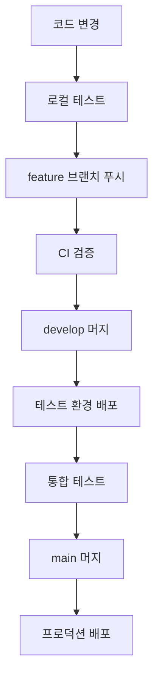

# 배포 가이드

이 문서는 Hanbit TODO 앱의 환경별 배포 방법과 CI/CD 파이프라인 사용법을 설명합니다.

## 📋 목차

- [사전 요구사항](#사전-요구사항)
- [환경별 배포](#환경별-배포)
- [스크립트 사용법](#스크립트-사용법)
- [CI/CD 파이프라인](#cicd-파이프라인)
- [문제 해결](#문제-해결)

## 🔧 사전 요구사항

### 필수 도구

- Node.js 18+
- pnpm 10.13.1+
- AWS CLI v2
- AWS CDK v2.115.0+

### AWS 계정 설정

1. AWS 계정 및 IAM 권한 설정
2. AWS CLI 자격증명 구성
3. CDK 부트스트랩 실행

```bash
# AWS 자격증명 설정
aws configure

# CDK 부트스트랩 (환경당 한 번만)
pnpm --filter @vive/infrastructure bootstrap
```

## 🌍 환경별 배포

### 개발 환경 (dev)

```bash
# 환경 설정 검증
pnpm scripts:env-check dev

# 배포 전 검증
pnpm pre-deploy:dev

# 배포 실행
pnpm deploy:dev

# 배포 후 검증
pnpm post-deploy:dev
```

### 테스트 환경 (test)

```bash
# 환경 설정 검증
pnpm scripts:env-check test

# 배포 전 검증
pnpm pre-deploy:test

# 배포 실행
pnpm deploy:test

# 배포 후 검증
pnpm post-deploy:test
```

### 프로덕션 환경 (prod)

```bash
# ⚠️ 프로덕션 배포는 특별한 주의가 필요합니다

# 1. 환경 설정 검증 (필수)
pnpm scripts:env-check prod

# 2. 배포 전 검증 (필수)
pnpm pre-deploy:prod

# 3. 배포 실행 (승인 필요)
pnpm deploy:prod

# 4. 배포 후 검증
pnpm post-deploy:prod
```

## 🛠️ 스크립트 사용법

### 배포 스크립트 (deploy.sh)

```bash
# 기본 배포
./scripts/deploy.sh dev

# 변경사항만 확인 (실제 배포 X)
./scripts/deploy.sh prod --dry-run

# 승인 없이 프로덕션 배포
./scripts/deploy.sh prod --force-approval

# 빌드/테스트 건너뛰기
./scripts/deploy.sh dev --skip-build --skip-tests
```

### 환경 검증 스크립트 (env-check.js)

```bash
# 개발 환경 검증
node scripts/env-check.js dev

# 테스트 환경 검증
node scripts/env-check.js test

# 프로덕션 환경 검증
node scripts/env-check.js prod
```

### 배포 전 검증 (pre-deploy.js)

```bash
# 모든 배포 전 검증 실행
node scripts/pre-deploy.js dev

# 포함 항목:
# - 환경 변수 검증
# - Lint 검사
# - 타입 체크
# - 테스트 실행
# - 빌드 검증
# - CDK 구문 검증
# - 보안 검사
```

### 배포 후 검증 (post-deploy.js)

```bash
# 배포 후 검증 실행
node scripts/post-deploy.js dev

# 포함 항목:
# - CloudFormation 스택 상태 확인
# - Lambda 함수 상태 확인
# - 데이터베이스 연결 테스트
# - API 헬스체크
# - 로그 스트림 확인
```

### 롤백 스크립트 (rollback.js)

```bash
# 롤백 실행 (대화형)
node scripts/rollback.js dev

# 롤백 옵션:
# 1. 이전 버전으로 롤백 (권장)
# 2. 특정 시점으로 롤백
# 3. 스택 완전 제거
# 4. 취소
```

## 🚀 CI/CD 파이프라인

### GitHub Actions 워크플로우

프로젝트는 자동화된 CI/CD 파이프라인을 제공합니다:

```
브랜치별 배포 전략:
- feature/* → 검증만 실행
- develop → 테스트 환경 자동 배포
- main → 프로덕션 환경 배포 (승인 필요)
```

### 파이프라인 단계

1. **환경 검증**: 배포 환경 및 설정 검증
2. **코드 품질**: Lint, 타입 체크, 포맷팅 검사
3. **단위 테스트**: 클라이언트/서버 테스트 실행
4. **E2E 테스트**: Playwright 기반 종단간 테스트
5. **빌드 검증**: 전체 프로젝트 빌드 확인
6. **보안 검사**: npm audit, CodeQL 분석
7. **배포**: 환경별 자동/수동 배포
8. **배포 후 검증**: 통합 테스트 및 모니터링

### GitHub Secrets 설정

```
AWS_ACCESS_KEY_ID=your-access-key
AWS_SECRET_ACCESS_KEY=your-secret-key
AWS_DEFAULT_REGION=your-region
```

### 환경별 승인 정책

- **dev**: 자동 배포
- **test**: 자동 배포
- **prod**: 수동 승인 필요

## 📁 배포 파일 구조

```
apps/server/infrastructure/
├── scripts/
│   ├── deploy.sh              # 메인 배포 스크립트
│   ├── pre-deploy.js          # 배포 전 검증
│   ├── post-deploy.js         # 배포 후 검증
│   ├── env-check.js           # 환경 설정 검증
│   ├── rollback.js            # 롤백 스크립트
│   └── manage-secrets.sh      # 비밀 정보 관리
├── deployments/               # 배포 히스토리 (자동 생성)
│   ├── dev-latest.json
│   ├── test-latest.json
│   └── prod-latest.json
└── config/
    ├── environment.ts         # 환경별 설정
    └── secrets.ts             # 비밀 설정
```

## 🏗️ 배포 워크플로우

### 일반적인 배포 순서



### 수동 배포 워크플로우

```bash
# 1. 환경 설정 확인
pnpm scripts:env-check <env>

# 2. 배포 전 검증
pnpm pre-deploy:<env>

# 3. 배포 실행
pnpm deploy:<env>

# 4. 배포 후 검증
pnpm post-deploy:<env>

# 5. 문제 발생시 롤백
pnpm rollback:<env>
```

## 🚨 문제 해결

### 자주 발생하는 문제

#### 1. AWS 자격증명 문제

```bash
Error: Unable to locate credentials

해결책:
aws configure
또는
export AWS_ACCESS_KEY_ID=...
export AWS_SECRET_ACCESS_KEY=...
```

#### 2. CDK 부트스트랩 필요

```bash
Error: This stack uses assets, so the toolkit stack must be deployed

해결책:
pnpm --filter @vive/infrastructure bootstrap
```

#### 3. 스택 업데이트 실패

```bash
Error: Stack is in UPDATE_ROLLBACK_FAILED state

해결책:
node scripts/rollback.js <env>
# 또는 AWS 콘솔에서 수동 복구
```

#### 4. 권한 부족 오류

```bash
Error: User is not authorized to perform

해결책:
IAM 정책 확인 및 필요한 권한 추가:
- CloudFormation: FullAccess
- Lambda: FullAccess
- DynamoDB: FullAccess
- API Gateway: FullAccess
- IAM: PassRole
```

### 롤백 가이드

#### 자동 롤백

```bash
# CI/CD에서 자동 실행됨
node scripts/rollback.js <env>
```

#### 수동 롤백

```bash
# 1. 롤백 스크립트 실행
node scripts/rollback.js <env>

# 2. 옵션 선택
# - 이전 버전으로 롤백 (권장)
# - 특정 시점으로 롤백
# - 스택 완전 제거

# 3. 확인 후 실행
```

### 로그 확인

```bash
# CloudWatch 로그
aws logs describe-log-groups --log-group-name-prefix "/aws/lambda/HanbitTodoStack"

# 스택 이벤트
aws cloudformation describe-stack-events --stack-name HanbitTodoStack-<Env>

# 배포 히스토리
cat apps/server/infrastructure/deployments/<env>-latest.json
```

## 📊 모니터링

### CloudWatch 대시보드

- 배포 후 자동 생성되는 대시보드에서 시스템 상태 모니터링
- API Gateway, Lambda, DynamoDB 메트릭 포함

### 알람 설정

- API 응답 시간 > 5초
- 에러율 > 1%
- DynamoDB 제한 도달

### 로그 모니터링

- Lambda 함수별 로그 스트림
- API Gateway 액세스 로그
- 애플리케이션 에러 로그

## 📞 지원

문제가 발생하면 다음을 확인하세요:

1. [배포 가이드](DEPLOYMENT_GUIDE.md)
2. [AWS CloudFormation 콘솔](https://console.aws.amazon.com/cloudformation/)
3. [CloudWatch 로그](https://console.aws.amazon.com/cloudwatch/home#logsV2:)
4. [GitHub Actions 로그](https://github.com/your-repo/actions)

추가 지원이 필요한 경우 이슈를 생성해주세요.
