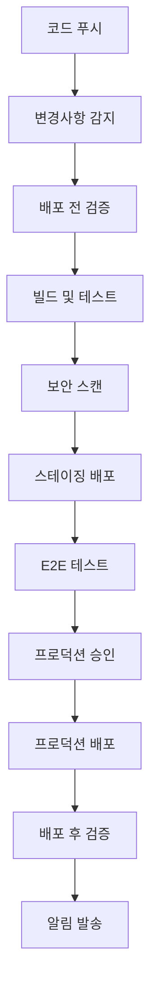

# 프로덕션 배포 가이드

## 📖 목차

1. [개요](#개요)
2. [사전 준비사항](#사전-준비사항)
3. [배포 환경 설정](#배포-환경-설정)
4. [자동 배포 프로세스](#자동-배포-프로세스)
5. [수동 배포](#수동-배포)
6. [배포 후 검증](#배포-후-검증)
7. [롤백 절차](#롤백-절차)
8. [모니터링 및 알림](#모니터링-및-알림)
9. [문제 해결](#문제-해결)
10. [보안 고려사항](#보안-고려사항)

---

## 개요

한빛 TODO 앱의 프로덕션 배포는 자동화된 CI/CD 파이프라인을 통해 안전하고 효율적으로 수행됩니다. 이 가이드는 배포 과정의 모든 단계를 상세히 설명합니다.

### 🏗️ 배포 아키텍처

```
개발자 → GitHub → GitHub Actions → AWS S3 → CloudFront → 사용자
              ↓
         자동 검증 & 테스트
              ↓
         스테이징 배포 → E2E 테스트
              ↓
         승인 프로세스 → 프로덕션 배포
```

### 🎯 배포 목표

- **Zero Downtime**: 무중단 배포
- **안전성**: 자동 롤백 및 검증
- **투명성**: 모든 단계 추적 가능
- **효율성**: 완전 자동화된 프로세스

---

## 사전 준비사항

### 🔧 필수 도구

- **Node.js** 18.17.0+
- **pnpm** 8.0.0+
- **AWS CLI** 2.0+
- **Git** 2.30+

### 🔑 필수 권한

**GitHub Secrets 설정:**

```
AWS_ACCESS_KEY_ID              # AWS 액세스 키
AWS_SECRET_ACCESS_KEY          # AWS 시크릿 키
S3_BUCKET_STAGING              # 스테이징 S3 버킷명
S3_BUCKET_PRODUCTION           # 프로덕션 S3 버킷명
CLOUDFRONT_DISTRIBUTION_STAGING # 스테이징 CloudFront ID
CLOUDFRONT_DISTRIBUTION_PRODUCTION # 프로덕션 CloudFront ID
SLACK_WEBHOOK                  # Slack 알림 웹훅
ALERT_EMAIL                    # 알림 이메일 주소
EMAIL_USERNAME                 # 이메일 발송용 계정
EMAIL_PASSWORD                 # 이메일 발송용 비밀번호
```

**AWS IAM 권한:**

```json
{
  "Version": "2012-10-17",
  "Statement": [
    {
      "Effect": "Allow",
      "Action": [
        "s3:GetObject",
        "s3:PutObject",
        "s3:DeleteObject",
        "s3:ListBucket",
        "s3:Sync"
      ],
      "Resource": ["arn:aws:s3:::todo-app-*", "arn:aws:s3:::todo-app-*/*"]
    },
    {
      "Effect": "Allow",
      "Action": ["cloudfront:CreateInvalidation", "cloudfront:GetDistribution"],
      "Resource": "*"
    }
  ]
}
```

### 📋 환경 설정 확인

배포 전 다음 사항을 확인하세요:

```bash
# 1. 프로덕션 검증 스크립트 실행
node scripts/production-validation.js

# 2. 빌드 테스트
pnpm build

# 3. 테스트 실행
pnpm test

# 4. AWS 연결 확인
aws s3 ls
```

---

## 배포 환경 설정

### 🌍 환경별 구성

#### 스테이징 환경

- **도메인**: staging.todo-app.com
- **S3 버킷**: todo-app-staging
- **용도**: 최종 테스트 및 검증

#### 프로덕션 환경

- **도메인**: todo-app.com
- **S3 버킷**: todo-app-production
- **용도**: 실제 서비스 제공

### ⚙️ 환경 변수 설정

각 환경별 설정 파일:

**스테이징 (`.env.staging`)**:

```bash
NODE_ENV=staging
VITE_API_BASE_URL=https://staging-api.todo-app.com
VITE_DOMAIN=staging.todo-app.com
VITE_LOG_LEVEL=debug
```

**프로덕션 (`.env.production`)**:

```bash
NODE_ENV=production
VITE_API_BASE_URL=https://api.todo-app.com
VITE_DOMAIN=todo-app.com
VITE_LOG_LEVEL=warn
```

### 🛠️ 인프라 초기 설정

```bash
# 1. 도메인 및 SSL 설정
node scripts/setup-domain.js

# 2. 모니터링 시스템 구축
node scripts/monitoring-setup.js

# 3. 백업 시스템 설정
node scripts/backup-restore.js setup
```

---

## 자동 배포 프로세스

### 🚀 GitHub Actions 워크플로우

#### 트리거 조건

1. **메인 브랜치 푸시**

   ```
   main/master 브랜치에 푸시 시 자동 배포
   ```

2. **태그 푸시**

   ```bash
   git tag v1.0.0
   git push origin v1.0.0
   ```

3. **수동 트리거**
   ```
   GitHub Actions 탭에서 워크플로우 수동 실행
   ```

#### 배포 단계



### 📊 배포 파이프라인 세부 단계

#### 1단계: 변경사항 감지

```yaml
- 클라이언트 코드 변경 확인
- 서버 코드 변경 확인
- 문서 변경 확인
- 불필요한 배포 방지
```

#### 2단계: 배포 전 검증

```bash
✓ Package.json 무결성 확인
✓ TypeScript 타입 검사
✓ ESLint 검사
✓ 단위 테스트 실행
✓ 의존성 취약점 스캔
```

#### 3단계: 빌드 및 테스트

```bash
✓ 환경별 빌드 (staging, production)
✓ 빌드 결과물 검증
✓ 테스트 커버리지 확인
✓ 아티팩트 업로드
```

#### 4단계: 스테이징 배포

```bash
✓ S3에 배포
✓ CloudFront 캐시 무효화
✓ 헬스체크 실행
✓ 기본 기능 테스트
```

#### 5단계: E2E 테스트

```bash
✓ Playwright E2E 테스트 실행
✓ 사용자 워크플로우 검증
✓ 크로스 브라우저 테스트
✓ 성능 테스트
```

#### 6단계: 프로덕션 배포

```bash
✓ 현재 배포 백업
✓ 프로덕션 S3에 배포
✓ CloudFront 캐시 무효화
✓ 종합 헬스체크
✓ 자동 롤백 (실패 시)
```

### 🔒 승인 프로세스

프로덕션 배포는 **수동 승인**이 필요합니다:

1. **스테이징 배포** 및 **E2E 테스트** 성공 후
2. **GitHub Environment Protection** 규칙에 따라
3. **승인자**가 배포를 검토하고 승인
4. 승인 후 **프로덕션 배포** 진행

---

## 수동 배포

자동 배포가 불가능한 경우 수동 배포를 사용할 수 있습니다.

### 🖥️ 로컬에서 배포

```bash
# 1. 사전 검증
node scripts/production-validation.js

# 2. 스테이징 배포
node scripts/deploy-production.js staging

# 3. 프로덕션 배포 (신중히!)
node scripts/deploy-production.js production
```

### 🎛️ 배포 옵션

```bash
# 테스트 건너뛰기
node scripts/deploy-production.js production --skip-tests

# 검증 건너뛰기 (긴급 상황)
node scripts/deploy-production.js production --skip-validation

# 자동 롤백 비활성화
node scripts/deploy-production.js production --no-rollback
```

### ⚡ 긴급 배포

크리티컬한 이슈 해결을 위한 긴급 배포:

```bash
# 1. 핫픽스 브랜치 생성
git checkout -b hotfix/critical-fix

# 2. 수정 및 커밋
git commit -m "fix: critical security issue"

# 3. 메인 브랜치에 병합
git checkout main
git merge hotfix/critical-fix

# 4. 즉시 배포
git push origin main  # 자동 배포 트리거
```

---

## 배포 후 검증

### 🏥 헬스체크

배포 후 다음 항목들이 자동으로 검증됩니다:

#### 기본 헬스체크

```bash
# 메인 페이지 로드 확인
curl -f https://todo-app.com/

# API 상태 확인
curl -f https://api.todo-app.com/health

# 정적 리소스 확인
curl -f https://todo-app.com/assets/index.js
```

#### 기능 테스트

```javascript
// 자동 실행되는 기능 테스트들
- 사용자 인터페이스 로드
- 게스트 모드 동작
- 할일 CRUD 기능
- 로컬 스토리지 연동
```

#### 성능 테스트

```bash
# 페이지 로드 시간 측정
- First Contentful Paint < 1.5초
- Largest Contentful Paint < 2.5초
- Cumulative Layout Shift < 0.1
```

### 📊 모니터링 대시보드

배포 후 다음 대시보드들을 확인하세요:

- **CloudWatch 대시보드**: https://console.aws.amazon.com/cloudwatch/home?region=us-east-1#dashboards:name=TodoApp-Production
- **웹사이트 상태**: https://todo-app.com
- **API 상태**: https://api.todo-app.com/health

### 🔔 자동 알림

배포 완료 시 다음 채널로 알림이 전송됩니다:

- **Slack** `#deployments` 채널
- **이메일** (실패 시만)
- **CloudWatch 알람** (이슈 발생 시)

---

## 롤백 절차

### 🔄 자동 롤백

헬스체크 실패 시 **자동으로 롤백**됩니다:

```bash
1. 헬스체크 실패 감지
2. 이전 버전으로 S3 복원
3. CloudFront 캐시 무효화
4. 롤백 완료 알림
```

### 🖐️ 수동 롤백

필요시 수동으로 롤백할 수 있습니다:

```bash
# 1. 백업 목록 확인
node scripts/backup-restore.js list

# 2. 특정 시점으로 롤백
node scripts/backup-restore.js restore 2024-01-15T10-30-00-000Z config

# 3. 또는 GitHub Actions 워크플로우에서 이전 커밋으로 재배포
```

### 🚨 긴급 롤백

즉시 롤백이 필요한 경우:

```bash
# AWS CLI를 통한 직접 롤백
aws s3 sync s3://todo-app-production-backups/backups/production/TIMESTAMP/ s3://todo-app-production/ --delete

# CloudFront 캐시 무효화
aws cloudfront create-invalidation --distribution-id XXXXXXXXXX --paths "/*"
```

---

## 모니터링 및 알림

### 📈 실시간 모니터링

#### CloudWatch 메트릭

- **요청 수**: CloudFront 요청 통계
- **에러율**: 4xx/5xx 에러 비율
- **응답시간**: 평균 응답 시간
- **가용성**: 업타임 모니터링

#### 커스텀 메트릭

- **사용자 등록**: 신규 사용자 수
- **할일 생성**: 생성된 할일 수
- **API 에러**: 애플리케이션 에러 수

### 🚨 알람 설정

#### 크리티컬 알람

- **5xx 에러율 > 1%**: 즉시 알림
- **4xx 에러율 > 5%**: 즉시 알림
- **응답시간 > 5초**: 즉시 알림
- **가용성 < 95%**: 즉시 알림

#### 경고 알람

- **캐시 히트율 < 80%**: 24시간 내 검토
- **디스크 사용률 > 90%**: 검토 필요

### 📧 알림 채널

- **Slack**: 일반 알림
- **이메일**: 크리티컬 이슈
- **SMS**: 긴급 상황 (설정 시)

---

## 문제 해결

### 🔧 일반적인 문제들

#### 배포 실패

**문제**: 빌드가 실패합니다

```bash
해결책:
1. package.json 의존성 확인
2. TypeScript 에러 해결
3. 테스트 실패 수정
4. 로컬에서 빌드 테스트: pnpm build
```

**문제**: S3 업로드 실패

```bash
해결책:
1. AWS 자격 증명 확인
2. S3 버킷 권한 확인
3. 네트워크 연결 상태 확인
4. 파일 크기 제한 확인
```

#### 헬스체크 실패

**문제**: 배포 후 사이트 접속 불가

```bash
진단 순서:
1. CloudFront 배포 상태 확인
2. S3 버킷 파일 확인
3. DNS 설정 확인
4. SSL 인증서 상태 확인

해결책:
1. CloudFront 캐시 강제 무효화
2. DNS 전파 대기 (최대 48시간)
3. 이전 버전으로 롤백
```

**문제**: API 연결 실패

```bash
확인사항:
1. API Gateway 상태
2. Lambda 함수 상태
3. CORS 설정
4. 환경 변수 설정

해결책:
1. API 엔드포인트 URL 확인
2. 환경 변수 재설정
3. API Gateway 재배포
```

### 🔍 디버깅 도구

#### 로그 확인

```bash
# CloudWatch 로그 확인
aws logs tail /aws/lambda/todo-app --follow

# GitHub Actions 로그 확인
# Actions 탭에서 워크플로우 실행 로그 검토

# 브라우저 개발자 도구
# 네트워크 탭에서 요청/응답 확인
```

#### 상태 확인 명령어

```bash
# DNS 확인
nslookup todo-app.com

# SSL 인증서 확인
openssl s_client -connect todo-app.com:443

# 응답 시간 측정
curl -w "@curl-format.txt" -o /dev/null -s https://todo-app.com/
```

### 📞 지원 요청

문제 해결이 어려운 경우:

1. **GitHub Issues**에 문제 보고
2. **Slack** `#dev-support` 채널
3. **이메일** devops@todo-app.com

**포함할 정보**:

- 발생 시간
- 에러 메시지
- 브라우저/디바이스 정보
- 재현 단계
- 스크린샷

---

## 보안 고려사항

### 🔒 보안 모범 사례

#### 액세스 관리

- **최소 권한 원칙**: 필요한 최소한의 권한만 부여
- **정기 권한 검토**: 분기별 권한 감사
- **MFA 필수**: 모든 관리자 계정에 2FA 설정

#### 시크릿 관리

- **GitHub Secrets**: 모든 민감한 정보는 GitHub Secrets에 저장
- **환경별 분리**: 스테이징과 프로덕션 시크릿 분리
- **정기 로테이션**: 3개월마다 API 키 교체

#### 네트워크 보안

- **HTTPS 강제**: 모든 통신 암호화
- **HSTS 헤더**: 브라우저 강제 HTTPS
- **CSP 헤더**: XSS 공격 방지
- **CORS 설정**: 허용된 도메인만 접근

### 🛡️ 보안 검사

#### 자동 보안 스캔

- **의존성 취약점**: npm audit, Snyk
- **코드 스캔**: CodeQL, ESLint Security
- **이미지 스캔**: Docker 이미지 보안 검사

#### 수동 보안 검사

```bash
# 의존성 취약점 확인
pnpm audit

# 보안 린트 실행
eslint --ext .js,.ts,.tsx src/ --config .eslintrc.security.js

# SSL 등급 확인
curl -s "https://api.ssllabs.com/api/v3/analyze?host=todo-app.com"
```

### 🚨 보안 인시던트 대응

#### 대응 절차

1. **즉시 격리**: 문제 컴포넌트 즉시 차단
2. **영향도 평가**: 피해 규모 및 범위 확인
3. **복구 실행**: 백업으로부터 복구
4. **근본 원인 분석**: 재발 방지 대책 수립
5. **보고서 작성**: 인시던트 보고서 작성

#### 연락처

- **보안팀**: security@todo-app.com
- **긴급 상황**: +82-2-123-4567
- **외부 신고**: KISA 인터넷 침해 신고센터

---

## 📚 추가 자료

### 🔗 관련 문서

- [개발자 가이드](../guides/developer-guide.md)
- [운영 매뉴얼](../guides/operations-manual.md)
- [API 문서](../api/openapi.yaml)

### 🛠️ 유용한 도구

- **AWS Console**: 인프라 관리
- **GitHub Actions**: CI/CD 관리
- **CloudWatch**: 모니터링
- **Slack**: 팀 커뮤니케이션

### 📖 참고 링크

- [AWS S3 정적 웹사이트 호스팅](https://docs.aws.amazon.com/AmazonS3/latest/userguide/WebsiteHosting.html)
- [CloudFront 배포 가이드](https://docs.aws.amazon.com/AmazonCloudFront/latest/DeveloperGuide/)
- [GitHub Actions 문서](https://docs.github.com/en/actions)

---

## 📋 체크리스트

### 배포 전 체크리스트

- [ ] 모든 테스트 통과
- [ ] 코드 리뷰 완료
- [ ] 환경 변수 설정 확인
- [ ] 백업 시스템 정상 동작
- [ ] 모니터링 시스템 정상
- [ ] 롤백 계획 수립

### 배포 후 체크리스트

- [ ] 웹사이트 정상 접속
- [ ] 주요 기능 동작 확인
- [ ] 성능 지표 정상
- [ ] 모니터링 알람 정상
- [ ] 로그 정상 수집
- [ ] 사용자 피드백 모니터링

### 긴급 상황 체크리스트

- [ ] 인시던트 팀 소집
- [ ] 영향도 평가 완료
- [ ] 롤백 여부 결정
- [ ] 사용자 공지 발송
- [ ] 복구 계획 실행
- [ ] 사후 분석 예약

---

_이 문서는 프로덕션 배포 과정에서 발생할 수 있는 모든 상황을 다루고 있습니다. 문의사항이 있으시면 개발팀에 연락해 주세요._

**마지막 업데이트**: 2024년 1월 15일  
**버전**: 1.0.0  
**작성자**: 한빛 개발팀
