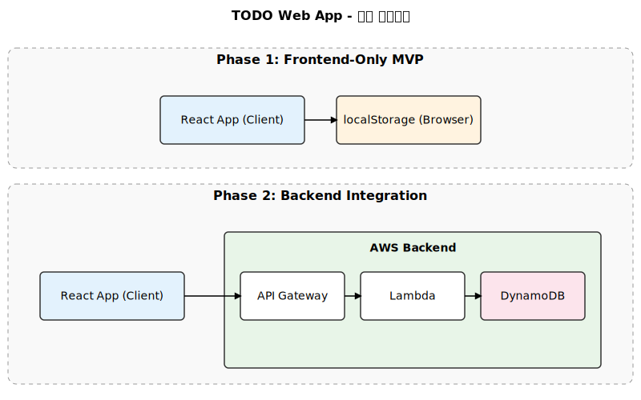
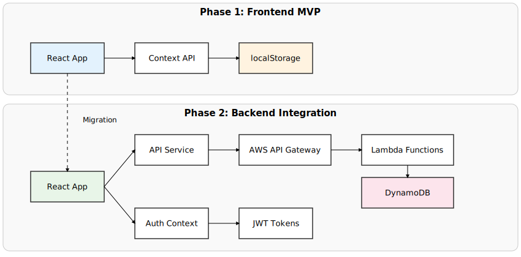
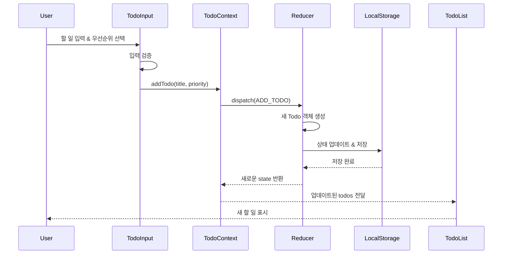
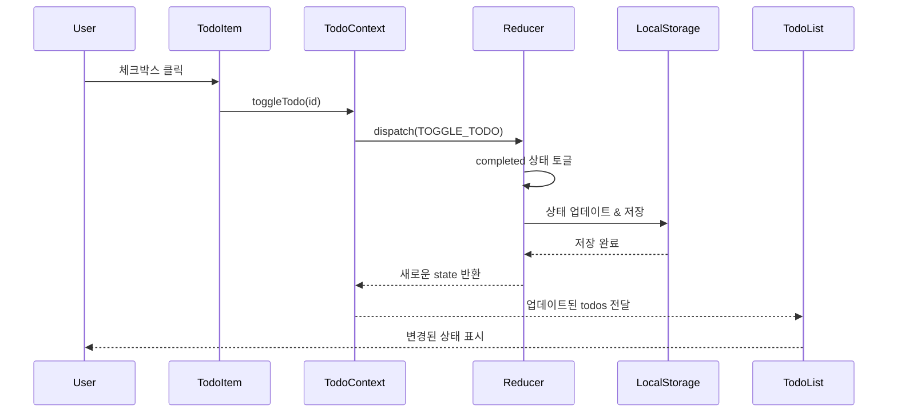
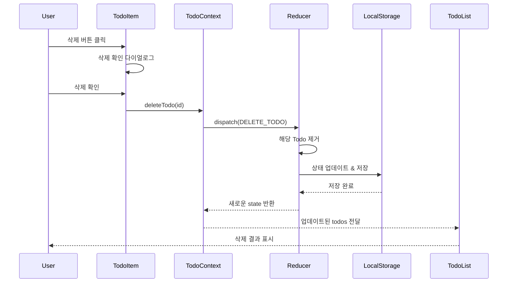
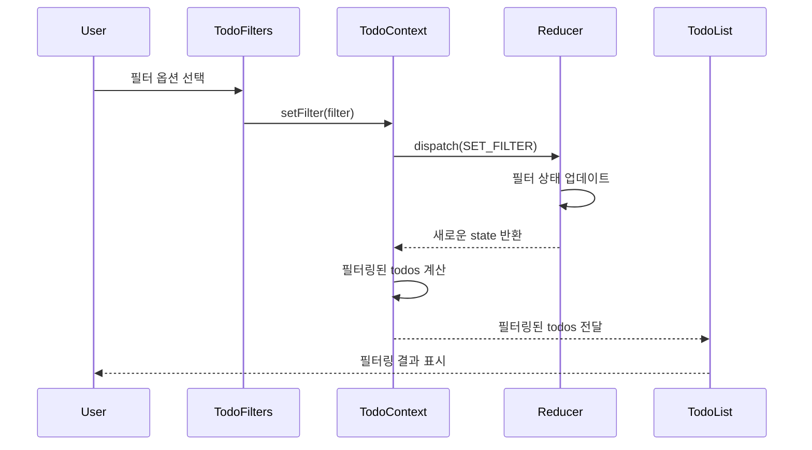
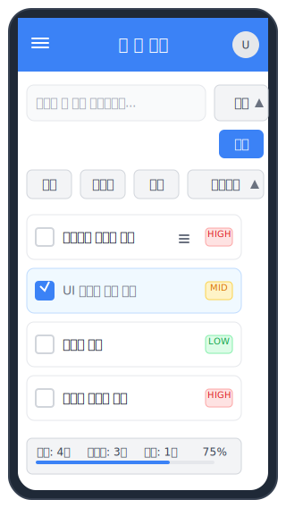
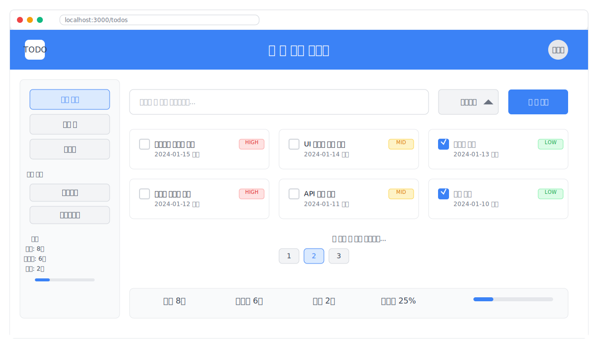

# TODO 웹 앱 설계문서

## 1. 문서 개요

### 1.1 목적
- TODO 웹 애플리케이션의 기술적 설계 명세
- 개발팀의 구현 가이드라인 제공
- 단계별 개발 전략에 따른 아키텍처 설계

### 1.2 범위
- 1단계: 프론트엔드 전용 MVP (localStorage 기반)
- 2단계: 백엔드 연동 확장 (AWS 서버리스)

### 1.3 기술 스택
- **모노레포 관리**: pnpm workspaces
- **프론트엔드**: React 18 + TypeScript + Tailwind CSS
- **UI Kit**: Shadcn/ui
- **빌드 도구**: Vite
- **상태 관리**: React Context + useReducer
- **테스트**: Jest + React Testing Library
- **배포**: GitHub Pages (1단계), AWS (2단계)

## 2. 시스템 아키텍처

### 2.1 전체 아키텍처 개요



### 2.2 1단계 아키텍처 (MVP)

```
Frontend Application
├── Presentation Layer (React Components)
├── Business Logic Layer (Custom Hooks)
├── State Management Layer (Context + Reducer)
└── Data Access Layer (localStorage Service)
```

### 2.3 2단계 확장 아키텍처 (AWS 서버리스)

```
┌─────────────────────────────────────────────────────────────────────────┐
│                        Client (React SPA)                               │
│  ┌──────────────────┐ ┌──────────────────┐ ┌──────────────────────────┐ │
│  │  Auth Context    │ │  API Service     │ │   Data Sync Manager      │ │
│  │  (Cognito SDK)   │ │  (HTTP Client)   │ │   (Optimistic Updates)   │ │
│  └──────────────────┘ └──────────────────┘ └──────────────────────────┘ │
└─────────────────────────────────────────────────────────────────────────┘
                                    │ HTTPS
                                    ▼
┌─────────────────────────────────────────────────────────────────────────┐
│                        AWS Cloud Infrastructure                         │
│                                                                         │
│  ┌─────────────────┐      ┌────────────────────────────────────────┐   │
│  │   CloudFront    │◄────►│          API Gateway (REST)            │   │
│  │  (CDN + CORS)   │      │  • /api/todos (CRUD operations)       │   │
│  └─────────────────┘      │  • /api/auth (authentication)         │   │
│                           │  • Cognito Authorizer integration     │   │
│                           └────────────────────────────────────────┘   │
│                                              │                         │
│                                              ▼                         │
│  ┌─────────────────────────────────────────────────────────────────┐   │
│  │                    AWS Lambda Functions                        │   │
│  │  ┌─────────────┐  ┌─────────────┐  ┌─────────────────────────┐ │   │
│  │  │ getTodos    │  │ createTodo  │  │     authHandler         │ │   │
│  │  │ handler     │  │ handler     │  │  (guest token issue)    │ │   │
│  │  └─────────────┘  └─────────────┘  └─────────────────────────┘ │   │
│  │  ┌─────────────┐  ┌─────────────┐  ┌─────────────────────────┐ │   │
│  │  │ updateTodo  │  │ deleteTodo  │  │     migrationHandler    │ │   │
│  │  │ handler     │  │ handler     │  │  (localStorage import)  │ │   │
│  │  └─────────────┘  └─────────────┘  └─────────────────────────┘ │   │
│  └─────────────────────────────────────────────────────────────────┘   │
│                                              │                         │
│                                              ▼                         │
│  ┌─────────────────┐                 ┌──────────────────────────────┐  │
│  │  Amazon Cognito │                 │       Amazon DynamoDB        │  │
│  │                 │                 │                              │  │
│  │ ┌─────────────┐ │                 │  ┌─────────────────────────┐ │  │
│  │ │ User Pool   │ │                 │  │    todos-app-data       │ │  │
│  │ │(Optional    │ │                 │  │  (Single Table Design)  │ │  │
│  │ │Registration)│ │                 │  │                         │ │  │
│  │ └─────────────┘ │                 │  │ PK: USER#{userId}       │ │  │
│  │ ┌─────────────┐ │                 │  │ SK: TODO#{todoId}       │ │  │
│  │ │Identity Pool│ │                 │  │ PK: GUEST#{sessionId}   │ │  │
│  │ │(Guest +     │ │◄────────────────┤  │ TTL: 24h (guest data)   │ │  │
│  │ │Authenticated│ │                 │  │                         │ │  │
│  │ │Roles)       │ │                 │  │ GSI1: Query optimization│ │  │
│  │ └─────────────┘ │                 │  └─────────────────────────┘ │  │
│  └─────────────────┘                 └──────────────────────────────┘  │
│                                                                        │
│  ┌──────────────────────────────────────────────────────────────────┐  │
│  │                    CloudWatch Monitoring                        │  │
│  │  • Lambda execution logs & metrics                              │  │
│  │  • API Gateway request/response logs                            │  │
│  │  • DynamoDB performance metrics                                 │  │
│  │  • X-Ray distributed tracing                                    │  │
│  └──────────────────────────────────────────────────────────────────┘  │
└─────────────────────────────────────────────────────────────────────────┘
```

#### 단계별 아키텍처 진화



## 3. 데이터 모델 설계

### 3.1 Todo 엔티티

```typescript
interface Todo {
  id: string;                    // UUID
  title: string;                // 할 일 제목 (필수)
  description?: string;         // 할 일 설명 (선택사항)
  completed: boolean;           // 완료 상태
  priority: Priority;           // 우선순위
  createdAt: string;           // ISO 8601 형식
  updatedAt: string;           // ISO 8601 형식
  
  // 2단계: 인증 관련 필드
  userId: string;              // Cognito User ID 또는 게스트 세션 ID  
  isGuest: boolean;            // 게스트 사용자 여부
  sessionId?: string;          // 게스트 세션 ID
}

type Priority = 'high' | 'medium' | 'low';
```

### 3.2 필터 및 정렬 타입

```typescript
enum FilterType {
  ALL = 'all',
  ACTIVE = 'active',
  COMPLETED = 'completed'
}

enum SortBy {
  CREATED_DATE = 'createdDate',
  PRIORITY = 'priority',
  TITLE = 'title'
}

interface TodoFilter {
  type: FilterType;
  sortBy: SortBy;
  sortOrder: 'asc' | 'desc';
}
```

### 3.3 사용자 및 인증 모델 (2단계)

```typescript
interface User {
  id: string;                   // Cognito User ID
  email?: string;               // 인증된 사용자만 보유
  isGuest: boolean;             // 게스트 여부
  createdAt: string;            // ISO 8601 형식
  lastLoginAt: string;          // 마지막 로그인 시간
  settings: UserSettings;       // 사용자 설정
}

interface UserSettings {
  theme: 'light' | 'dark';      // 테마 설정
  defaultPriority: Priority;    // 기본 우선순위
  autoSort: boolean;            // 자동 정렬 여부
}

// 권한 시스템
interface GuestPermissions {
  canRead: boolean;      // true - 샘플 데이터 읽기
  canCreate: boolean;    // true - 임시 TODO 생성 (세션 기반)
  canUpdate: boolean;    // true - 세션 내 수정
  canDelete: boolean;    // true - 세션 내 삭제
  persistData: boolean;  // false - 영구 저장 불가
  maxItems: number;      // 10 - 최대 항목 수 제한
}

interface AuthenticatedPermissions {
  canRead: boolean;      // true - 본인 데이터 읽기
  canCreate: boolean;    // true - 무제한 생성
  canUpdate: boolean;    // true - 본인 데이터 수정
  canDelete: boolean;    // true - 본인 데이터 삭제
  persistData: boolean;  // true - 영구 저장
  maxItems: number;      // 1000 - 최대 항목 수
}

// 인증 상태
interface AuthState {
  isAuthenticated: boolean;
  isGuest: boolean;
  user: User | null;
  permissions: GuestPermissions | AuthenticatedPermissions;
  cognitoCredentials: any; // AWS Cognito credentials
}
```

### 3.4 애플리케이션 상태

```typescript
interface AppState {
  todos: Todo[];
  filter: TodoFilter;
  loading: boolean;
  error: string | null;
  
  // 2단계: 인증 상태 추가
  auth: AuthState;
  
  // 동기화 상태 (2단계)
  sync: {
    isOnline: boolean;
    lastSyncAt: string | null;
    pendingActions: PendingAction[];
  };
}

interface PendingAction {
  id: string;
  type: 'create' | 'update' | 'delete';
  payload: any;
  timestamp: string;
  retryCount: number;
}
```

## 4. 컴포넌트 설계

### 4.1 컴포넌트 계층 구조

```
App
├── Header
│   ├── Logo
│   └── UserInfo (2단계)
├── TodoContainer
│   ├── TodoInput
│   ├── TodoFilters
│   ├── TodoList
│   │   └── TodoItem
│   │       ├── TodoText
│   │       ├── PriorityBadge
│   │       └── TodoActions
│   └── TodoStats
└── Footer
```

#### 컴포넌트 구조 다이어그램


### 4.2 주요 컴포넌트 명세

#### 4.2.1 TodoInput 컴포넌트
```typescript
interface TodoInputProps {
  onAddTodo: (title: string, priority: Priority) => void;
  placeholder?: string;
}

// 책임:
// - 새 할 일 입력 받기
// - 우선순위 선택
// - 입력 검증
// - 엔터키/버튼 클릭으로 추가
```

#### 4.2.2 TodoItem 컴포넌트
```typescript
interface TodoItemProps {
  todo: Todo;
  onToggle: (id: string) => void;
  onDelete: (id: string) => void;
  onEdit: (id: string, title: string) => void;
}

// 책임:
// - 할 일 정보 표시
// - 완료 상태 토글
// - 인라인 편집 모드
// - 삭제 확인
```

#### 4.2.3 TodoFilters 컴포넌트
```typescript
interface TodoFiltersProps {
  currentFilter: TodoFilter;
  onFilterChange: (filter: TodoFilter) => void;
  todoCount: {
    total: number;
    active: number;
    completed: number;
  };
}

// 책임:
// - 필터 옵션 제공
// - 정렬 옵션 제공
// - 할 일 개수 표시
```

## 5. 상태 관리 설계

### 5.1 Context 구조

```typescript
interface TodoContextType {
  state: AppState;
  dispatch: React.Dispatch<TodoAction>;
  // 편의 메서드들
  addTodo: (title: string, priority: Priority) => void;
  toggleTodo: (id: string) => void;
  deleteTodo: (id: string) => void;
  editTodo: (id: string, title: string) => void;
  setFilter: (filter: TodoFilter) => void;
}
```

### 5.2 Reducer Actions

```typescript
type TodoAction =
  | { type: 'ADD_TODO'; payload: { title: string; priority: Priority } }
  | { type: 'TOGGLE_TODO'; payload: { id: string } }
  | { type: 'DELETE_TODO'; payload: { id: string } }
  | { type: 'EDIT_TODO'; payload: { id: string; title: string } }
  | { type: 'SET_FILTER'; payload: TodoFilter }
  | { type: 'SET_LOADING'; payload: boolean }
  | { type: 'SET_ERROR'; payload: string | null }
  | { type: 'LOAD_TODOS'; payload: Todo[] };
```

### 5.3 Custom Hooks

```typescript
// 비즈니스 로직을 캡슐화하는 커스텀 훅들
const useTodos = () => {
  // TodoContext 사용 및 편의 메서드 제공
};

const useLocalStorage = <T>(key: string, initialValue: T) => {
  // localStorage 동기화
};

const useTodoFilters = () => {
  // 필터링 및 정렬 로직
};
```

### 5.4 데이터 플로우 예시

#### 할 일 추가 플로우



#### 할 일 완료 토글 플로우



#### 할 일 삭제 플로우



#### 필터링 플로우



## 6. API 설계 (2단계)

### 6.1 REST API 엔드포인트 명세

#### 6.1.1 TODO CRUD API
```typescript
// Base URL: https://api.todo-app.com/api/v1

// 1. 할 일 목록 조회
GET /todos
Headers: {
  "Authorization": "Bearer <cognito-token>",
  "Content-Type": "application/json"
}
Query Parameters: {
  limit?: number,     // pagation limit (default: 20)
  cursor?: string,    // pagination cursor
  filter?: 'all' | 'active' | 'completed',
  sortBy?: 'createdAt' | 'priority' | 'title',
  sortOrder?: 'asc' | 'desc'
}

Response: {
  "success": true,
  "data": {
    "todos": Todo[],
    "pagination": {
      "hasNextPage": boolean,
      "nextCursor": string | null,
      "totalCount": number
    },
    "metadata": {
      "userLimits": {
        "maxItems": number,
        "currentCount": number,
        "isGuest": boolean
      }
    }
  }
}

// 2. 새 할 일 생성
POST /todos
Headers: {
  "Authorization": "Bearer <cognito-token>",
  "Content-Type": "application/json"
}
Body: {
  "title": string,
  "description"?: string,
  "priority": Priority
}

Response: {
  "success": true,
  "data": {
    "todo": Todo,
    "remainingQuota": number // 게스트 사용자의 경우
  }
}

// 3. 특정 할 일 조회
GET /todos/{todoId}
Headers: {
  "Authorization": "Bearer <cognito-token>"
}

Response: {
  "success": true,
  "data": {
    "todo": Todo
  }
}

// 4. 할 일 수정
PUT /todos/{todoId}
Headers: {
  "Authorization": "Bearer <cognito-token>",
  "Content-Type": "application/json"
}
Body: {
  "title"?: string,
  "description"?: string,
  "priority"?: Priority,
  "completed"?: boolean
}

Response: {
  "success": true,
  "data": {
    "todo": Todo
  }
}

// 5. 할 일 삭제
DELETE /todos/{todoId}
Headers: {
  "Authorization": "Bearer <cognito-token>"
}

Response: {
  "success": true,
  "data": {
    "deletedId": string
  }
}
```

#### 6.1.2 인증 관련 API
```typescript
// 1. 게스트 토큰 발급
POST /auth/guest
Headers: {
  "Content-Type": "application/json"
}

Response: {
  "success": true,
  "data": {
    "guestToken": string,        // Cognito Identity Pool 토큰
    "sessionId": string,         // 게스트 세션 ID
    "expiresIn": number,         // 토큰 만료 시간 (초)
    "permissions": GuestPermissions,
    "sampleTodos": Todo[]        // 샘플 할 일 데이터
  }
}

// 2. 토큰 갱신
POST /auth/refresh
Headers: {
  "Authorization": "Bearer <refresh-token>",
  "Content-Type": "application/json"
}

Response: {
  "success": true,
  "data": {
    "accessToken": string,
    "expiresIn": number
  }
}

// 3. 사용자 정보 조회
GET /auth/me
Headers: {
  "Authorization": "Bearer <cognito-token>"
}

Response: {
  "success": true,
  "data": {
    "user": User,
    "permissions": GuestPermissions | AuthenticatedPermissions
  }
}
```

#### 6.1.3 데이터 관리 API
```typescript
// 1. 데이터 내보내기
GET /export
Headers: {
  "Authorization": "Bearer <cognito-token>"
}
Query Parameters: {
  format?: 'json' | 'csv'
}

Response: {
  "success": true,
  "data": {
    "exportUrl": string,        // 다운로드 URL (pre-signed)
    "expiresAt": string,        // URL 만료 시간
    "format": string,
    "totalItems": number
  }
}

// 2. 데이터 가져오기
POST /import
Headers: {
  "Authorization": "Bearer <cognito-token>",
  "Content-Type": "multipart/form-data"
}
Body: FormData {
  file: File,                   // JSON/CSV 파일
  options: {
    "mergeStrategy": "replace" | "merge",
    "validateData": boolean
  }
}

Response: {
  "success": true,
  "data": {
    "importedCount": number,
    "skippedCount": number,
    "errors": string[]
  }
}

// 3. localStorage 마이그레이션
POST /migrate
Headers: {
  "Authorization": "Bearer <cognito-token>",
  "Content-Type": "application/json"
}
Body: {
  "localStorageData": Todo[],
  "migrationOptions": {
    "preserveIds": boolean,
    "mergeStrategy": "replace" | "merge"
  }
}

Response: {
  "success": true,
  "data": {
    "migratedCount": number,
    "duplicateCount": number,
    "totalCount": number
  }
}
```

### 6.2 에러 응답 표준화

```typescript
// 에러 응답 형식
interface ErrorResponse {
  success: false;
  error: {
    code: string;           // 에러 코드 (VALIDATION_ERROR, UNAUTHORIZED 등)
    message: string;        // 사용자 친화적 메시지
    details?: any;          // 상세 정보 (개발 환경에서만)
    timestamp: string;      // ISO 8601 형식
    requestId: string;      // 추적용 요청 ID
  };
}

// 공통 에러 코드
enum ErrorCode {
  // 인증 관련
  UNAUTHORIZED = 'UNAUTHORIZED',
  FORBIDDEN = 'FORBIDDEN',
  TOKEN_EXPIRED = 'TOKEN_EXPIRED',
  
  // 검증 관련
  VALIDATION_ERROR = 'VALIDATION_ERROR',
  INVALID_REQUEST = 'INVALID_REQUEST',
  
  // 리소스 관련
  NOT_FOUND = 'NOT_FOUND',
  CONFLICT = 'CONFLICT',
  QUOTA_EXCEEDED = 'QUOTA_EXCEEDED',
  
  // 서버 관련
  INTERNAL_ERROR = 'INTERNAL_ERROR',
  SERVICE_UNAVAILABLE = 'SERVICE_UNAVAILABLE'
}
```

### 6.3 API 클라이언트 설계

```typescript
class TodoAPIClient {
  private baseURL: string;
  private authService: AuthService;

  constructor(baseURL: string, authService: AuthService) {
    this.baseURL = baseURL;
    this.authService = authService;
  }

  // HTTP 요청 래퍼
  private async request<T>(
    endpoint: string,
    options: RequestInit
  ): Promise<APIResponse<T>> {
    const token = await this.authService.getValidToken();
    
    const response = await fetch(`${this.baseURL}${endpoint}`, {
      ...options,
      headers: {
        'Authorization': `Bearer ${token}`,
        'Content-Type': 'application/json',
        ...options.headers,
      },
    });

    if (!response.ok) {
      const errorData = await response.json();
      throw new APIError(errorData);
    }

    return response.json();
  }

  // TODO CRUD 메서드들
  async getTodos(params?: GetTodosParams): Promise<GetTodosResponse> {
    const queryString = params ? new URLSearchParams(params).toString() : '';
    return this.request(`/todos?${queryString}`, { method: 'GET' });
  }

  async createTodo(data: CreateTodoRequest): Promise<CreateTodoResponse> {
    return this.request('/todos', {
      method: 'POST',
      body: JSON.stringify(data),
    });
  }

  async updateTodo(id: string, data: UpdateTodoRequest): Promise<UpdateTodoResponse> {
    return this.request(`/todos/${id}`, {
      method: 'PUT',
      body: JSON.stringify(data),
    });
  }

  async deleteTodo(id: string): Promise<DeleteTodoResponse> {
    return this.request(`/todos/${id}`, { method: 'DELETE' });
  }

  // 데이터 관리 메서드들
  async exportData(format: 'json' | 'csv' = 'json'): Promise<ExportResponse> {
    return this.request(`/export?format=${format}`, { method: 'GET' });
  }

  async migrateFromLocalStorage(data: Todo[]): Promise<MigrationResponse> {
    return this.request('/migrate', {
      method: 'POST',
      body: JSON.stringify({ localStorageData: data }),
    });
  }
}
```

## 7. 데이터 레이어 설계

### 6.1 1단계: localStorage Service

```typescript
class LocalStorageService {
  private readonly TODOS_KEY = 'todos';

  async getTodos(): Promise<Todo[]> {
    // localStorage에서 todos 조회
  }

  async saveTodos(todos: Todo[]): Promise<void> {
    // localStorage에 todos 저장
  }

  async addTodo(todo: Omit<Todo, 'id' | 'createdAt' | 'updatedAt'>): Promise<Todo> {
    // 새 todo 추가
  }

  async updateTodo(id: string, updates: Partial<Todo>): Promise<Todo> {
    // todo 업데이트
  }

  async deleteTodo(id: string): Promise<void> {
    // todo 삭제
  }
}
```

### 7.2 2단계: DynamoDB Single Table Design

#### 7.2.1 테이블 구조
```typescript
// Primary Table: todos-app-data
interface DynamoDBItem {
  PK: string;                 // Partition Key
  SK: string;                 // Sort Key
  GSI1PK?: string;           // Global Secondary Index 1 - Partition Key
  GSI1SK?: string;           // Global Secondary Index 1 - Sort Key
  itemType: 'TODO' | 'USER' | 'SETTINGS' | 'SESSION';
  data: TodoItem | User | UserSettings | GuestSession;
  ttl?: number;              // Time To Live (게스트 데이터용)
  createdAt: string;         // 생성 시간
  updatedAt: string;         // 수정 시간
}

// 데이터 접근 패턴
enum AccessPattern {
  // 사용자별 TODO 조회
  GET_USER_TODOS = 'PK = USER#{userId} AND begins_with(SK, "TODO#")',
  
  // 게스트 세션별 TODO 조회  
  GET_GUEST_TODOS = 'PK = GUEST#{sessionId} AND begins_with(SK, "TODO#")',
  
  // 특정 TODO 조회
  GET_TODO_BY_ID = 'PK = USER#{userId} AND SK = TODO#{todoId}',
  
  // 사용자 설정 조회
  GET_USER_SETTINGS = 'PK = USER#{userId} AND SK = SETTINGS',
  
  // 우선순위별 정렬 (GSI1 사용)
  GET_TODOS_BY_PRIORITY = 'GSI1PK = USER#{userId} AND begins_with(GSI1SK, "PRIORITY#{priority}")',
  
  // 생성일별 정렬 (GSI1 사용)  
  GET_TODOS_BY_DATE = 'GSI1PK = USER#{userId} AND begins_with(GSI1SK, "DATE#{createdAt}")'
}
```

#### 7.2.2 데이터 예시
```typescript
// 1. 인증된 사용자의 TODO
{
  PK: "USER#auth0|123456",
  SK: "TODO#uuid-1234",
  GSI1PK: "USER#auth0|123456",
  GSI1SK: "PRIORITY#high#2024-01-15T10:00:00Z",
  itemType: "TODO",
  data: {
    id: "uuid-1234",
    title: "회의 준비",
    description: "프레젠테이션 자료 준비",
    priority: "high",
    completed: false,
    userId: "auth0|123456",
    isGuest: false,
    createdAt: "2024-01-15T10:00:00Z",
    updatedAt: "2024-01-15T10:00:00Z"
  },
  createdAt: "2024-01-15T10:00:00Z",
  updatedAt: "2024-01-15T10:00:00Z"
}

// 2. 게스트 사용자의 TODO (TTL 적용)
{
  PK: "GUEST#session-abcd-1234",
  SK: "TODO#uuid-5678",
  GSI1PK: "GUEST#session-abcd-1234",
  GSI1SK: "DATE#2024-01-15T10:30:00Z",
  itemType: "TODO",
  data: {
    id: "uuid-5678",
    title: "장보기",
    priority: "medium",
    completed: false,
    userId: "session-abcd-1234",
    isGuest: true,
    sessionId: "session-abcd-1234",
    createdAt: "2024-01-15T10:30:00Z",
    updatedAt: "2024-01-15T10:30:00Z"
  },
  ttl: 1705413000,  // 24시간 후 자동 삭제
  createdAt: "2024-01-15T10:30:00Z",
  updatedAt: "2024-01-15T10:30:00Z"
}

// 3. 사용자 정보
{
  PK: "USER#auth0|123456",
  SK: "PROFILE",
  itemType: "USER",
  data: {
    id: "auth0|123456",
    email: "user@example.com",
    isGuest: false,
    createdAt: "2024-01-10T09:00:00Z",
    lastLoginAt: "2024-01-15T08:00:00Z",
    settings: {
      theme: "light",
      defaultPriority: "medium",
      autoSort: true
    }
  },
  createdAt: "2024-01-10T09:00:00Z",
  updatedAt: "2024-01-15T08:00:00Z"
}

// 4. 게스트 세션 정보
{
  PK: "GUEST#session-abcd-1234",
  SK: "SESSION",
  itemType: "SESSION",
  data: {
    sessionId: "session-abcd-1234",
    createdAt: "2024-01-15T10:00:00Z",
    lastAccessAt: "2024-01-15T10:30:00Z",
    todoCount: 3,
    maxTodos: 10
  },
  ttl: 1705413000,  // 24시간 후 자동 삭제
  createdAt: "2024-01-15T10:00:00Z",
  updatedAt: "2024-01-15T10:30:00Z"
}
```

#### 7.2.3 Repository 패턴 구현
```typescript
interface TodoRepository {
  getTodos(userId: string, options?: GetTodosOptions): Promise<Todo[]>;
  getTodoById(userId: string, todoId: string): Promise<Todo | null>;
  createTodo(userId: string, todo: CreateTodoRequest): Promise<Todo>;
  updateTodo(userId: string, todoId: string, updates: UpdateTodoRequest): Promise<Todo>;
  deleteTodo(userId: string, todoId: string): Promise<void>;
  getUserQuota(userId: string): Promise<UserQuota>;
}

class DynamoDBTodoRepository implements TodoRepository {
  constructor(
    private dynamoClient: DynamoDBClient,
    private tableName: string
  ) {}

  async getTodos(userId: string, options: GetTodosOptions = {}): Promise<Todo[]> {
    const { filter, sortBy, sortOrder, limit = 20, cursor } = options;
    
    const pkValue = userId.startsWith('session-') 
      ? `GUEST#${userId}` 
      : `USER#${userId}`;

    let queryParams: QueryCommandInput = {
      TableName: this.tableName,
      KeyConditionExpression: 'PK = :pk AND begins_with(SK, :sk)',
      ExpressionAttributeValues: {
        ':pk': pkValue,
        ':sk': 'TODO#'
      },
      Limit: limit
    };

    // 정렬 옵션에 따른 GSI 사용
    if (sortBy === 'priority' || sortBy === 'createdAt') {
      queryParams.IndexName = 'GSI1';
      queryParams.KeyConditionExpression = 'GSI1PK = :gsi1pk';
      queryParams.ExpressionAttributeValues[':gsi1pk'] = pkValue;
    }

    // 페이지네이션 커서 처리
    if (cursor) {
      queryParams.ExclusiveStartKey = JSON.parse(
        Buffer.from(cursor, 'base64').toString()
      );
    }

    const result = await this.dynamoClient.send(new QueryCommand(queryParams));
    
    return result.Items?.map(item => item.data as Todo) || [];
  }

  async createTodo(userId: string, todoData: CreateTodoRequest): Promise<Todo> {
    const todoId = generateUUID();
    const now = new Date().toISOString();
    const isGuest = userId.startsWith('session-');
    
    const todo: Todo = {
      id: todoId,
      title: todoData.title,
      description: todoData.description,
      priority: todoData.priority,
      completed: false,
      userId,
      isGuest,
      ...(isGuest && { sessionId: userId }),
      createdAt: now,
      updatedAt: now
    };

    const pkValue = isGuest ? `GUEST#${userId}` : `USER#${userId}`;
    const ttl = isGuest ? Math.floor(Date.now() / 1000) + (24 * 60 * 60) : undefined;

    const item: DynamoDBItem = {
      PK: pkValue,
      SK: `TODO#${todoId}`,
      GSI1PK: pkValue,
      GSI1SK: `PRIORITY#${todo.priority}#${now}`,
      itemType: 'TODO',
      data: todo,
      ...(ttl && { ttl }),
      createdAt: now,
      updatedAt: now
    };

    await this.dynamoClient.send(new PutItemCommand({
      TableName: this.tableName,
      Item: marshall(item)
    }));

    return todo;
  }

  // 기타 CRUD 메서드들...
}
```

### 7.3 API Service 추상화

```typescript
interface TodoService {
  getTodos(userId: string, options?: GetTodosOptions): Promise<GetTodosResponse>;
  createTodo(userId: string, todo: CreateTodoRequest): Promise<CreateTodoResponse>;
  updateTodo(userId: string, todoId: string, updates: UpdateTodoRequest): Promise<UpdateTodoResponse>;
  deleteTodo(userId: string, todoId: string): Promise<DeleteTodoResponse>;
  migrateFromLocalStorage(userId: string, todos: Todo[]): Promise<MigrationResponse>;
}

// 구현체들
class LocalStorageService implements TodoService { ... }
class DynamoDBTodoService implements TodoService { 
  constructor(private repository: TodoRepository) {}
  // Repository 패턴을 통한 데이터 접근
}
```

## 8. 통합 백엔드 설계 (Lambda + CDK) (2단계)

### 8.1 통합 프로젝트 구조

```typescript
// 📁 apps/backend/                  // 백엔드 + 인프라 통합 관리
// ├── infrastructure/               // CDK 인프라 코드
// │   ├── bin/
// │   │   └── app.ts               // CDK 앱 진입점
// │   ├── lib/
// │   │   ├── todo-app-stack.ts    // 메인 스택 (다른 스택들 조합)
// │   │   ├── auth-stack.ts        // Cognito 설정
// │   │   ├── api-stack.ts         // API Gateway + Lambda
// │   │   ├── database-stack.ts    // DynamoDB 설정
// │   │   ├── monitoring-stack.ts  // CloudWatch 설정
// │   │   └── shared/
// │   │       ├── constructs/      // 재사용 가능한 구성 요소
// │   │       └── constants.ts     // 공통 상수
// │   └── cdk.json                 // CDK 설정
// │
// ├── lambda/                      // Lambda 함수 코드
// │   ├── functions/
// │   │   ├── get-todos/
// │   │   │   ├── index.ts
// │   │   │   └── handler.test.ts
// │   │   ├── create-todo/
// │   │   │   ├── index.ts
// │   │   │   └── handler.test.ts
// │   │   ├── update-todo/
// │   │   ├── delete-todo/
// │   │   └── auth-handler/
// │   ├── shared/                  // 공유 로직
// │   │   ├── models/              // 데이터 모델
// │   │   ├── services/            // 비즈니스 로직
// │   │   ├── repositories/        // 데이터 접근 계층
// │   │   ├── middleware/          // Lambda 미들웨어
// │   │   └── utils/               // 유틸리티
// │   └── layers/                  // Lambda Layers (공통 의존성)
// │
// ├── package.json                 // 통합 의존성 관리
// ├── tsconfig.json                // TypeScript 설정
// ├── jest.config.js               // 테스트 설정
// ├── esbuild.config.js            // Lambda 빌드 설정
// └── README.md
```

### 8.2 메인 스택 구성

```typescript
// infrastructure/lib/todo-app-stack.ts
export class TodoAppStack extends Stack {
  constructor(scope: Construct, id: string, props: TodoAppStackProps) {
    super(scope, id, props);

    // 1. 데이터베이스 스택
    const databaseStack = new DatabaseStack(this, 'Database', {
      environment: props.environment,
      tableName: `todos-app-data-${props.environment}`
    });

    // 2. 인증 스택  
    const authStack = new AuthStack(this, 'Auth', {
      environment: props.environment,
      userPoolName: `todos-user-pool-${props.environment}`
    });

    // 3. API 스택
    const apiStack = new ApiStack(this, 'API', {
      environment: props.environment,
      table: databaseStack.table,
      userPool: authStack.userPool,
      identityPool: authStack.identityPool
    });

    // 4. 모니터링 스택
    const monitoringStack = new MonitoringStack(this, 'Monitoring', {
      environment: props.environment,
      lambdaFunctions: apiStack.lambdaFunctions,
      apiGateway: apiStack.api
    });
  }
}
```

### 8.2 인증 스택 (Cognito)

```typescript
export class AuthStack extends NestedStack {
  public readonly userPool: UserPool;
  public readonly identityPool: IdentityPool;
  public readonly guestRole: Role;
  public readonly authenticatedRole: Role;

  constructor(scope: Construct, id: string, props: AuthStackProps) {
    super(scope, id, props);

    // 1. Cognito User Pool 생성
    this.userPool = new UserPool(this, 'UserPool', {
      userPoolName: props.userPoolName,
      selfSignUpEnabled: true,
      signInAliases: {
        email: true,
      },
      passwordPolicy: {
        minLength: 8,
        requireLowercase: true,
        requireUppercase: true,
        requireDigits: true,
        requireSymbols: false,
      },
      accountRecovery: AccountRecovery.EMAIL_ONLY,
      removalPolicy: props.environment === 'prod' 
        ? RemovalPolicy.RETAIN 
        : RemovalPolicy.DESTROY,
    });

    // 2. User Pool Client 생성
    const userPoolClient = new UserPoolClient(this, 'UserPoolClient', {
      userPool: this.userPool,
      generateSecret: false, // 프론트엔드에서는 secret 불필요
      authFlows: {
        userPassword: true,
        userSrp: true,
      },
      oAuth: {
        flows: {
          authorizationCodeGrant: true,
        },
        scopes: [OAuthScope.OPENID, OAuthScope.EMAIL, OAuthScope.PROFILE],
      },
    });

    // 3. 게스트 사용자용 IAM Role
    this.guestRole = new Role(this, 'GuestRole', {
      assumedBy: new FederatedPrincipal(
        'cognito-identity.amazonaws.com',
        {
          StringEquals: {
            'cognito-identity.amazonaws.com:aud': '', // Identity Pool ID로 대체됨
          },
          'ForAnyValue:StringLike': {
            'cognito-identity.amazonaws.com:amr': 'unauthenticated',
          },
        },
        'sts:AssumeRoleWithWebIdentity'
      ),
      inlinePolicies: {
        GuestDynamoDBAccess: new PolicyDocument({
          statements: [
            new PolicyStatement({
              effect: Effect.ALLOW,
              actions: [
                'dynamodb:GetItem',
                'dynamodb:PutItem',
                'dynamodb:UpdateItem',
                'dynamodb:DeleteItem',
                'dynamodb:Query',
              ],
              resources: [props.tableArn],
              conditions: {
                'ForAllValues:StringLike': {
                  'dynamodb:LeadingKeys': ['GUEST#${cognito-identity.amazonaws.com:sub}'],
                },
              },
            }),
          ],
        }),
      },
    });

    // 4. 인증된 사용자용 IAM Role
    this.authenticatedRole = new Role(this, 'AuthenticatedRole', {
      assumedBy: new FederatedPrincipal(
        'cognito-identity.amazonaws.com',
        {
          StringEquals: {
            'cognito-identity.amazonaws.com:aud': '', // Identity Pool ID로 대체됨
          },
          'ForAnyValue:StringLike': {
            'cognito-identity.amazonaws.com:amr': 'authenticated',
          },
        },
        'sts:AssumeRoleWithWebIdentity'
      ),
      inlinePolicies: {
        AuthenticatedDynamoDBAccess: new PolicyDocument({
          statements: [
            new PolicyStatement({
              effect: Effect.ALLOW,
              actions: [
                'dynamodb:GetItem',
                'dynamodb:PutItem',
                'dynamodb:UpdateItem',
                'dynamodb:DeleteItem',
                'dynamodb:Query',
                'dynamodb:BatchGetItem',
                'dynamodb:BatchWriteItem',
              ],
              resources: [props.tableArn, `${props.tableArn}/index/*`],
              conditions: {
                'ForAllValues:StringLike': {
                  'dynamodb:LeadingKeys': ['USER#${cognito-identity.amazonaws.com:sub}'],
                },
              },
            }),
          ],
        }),
      },
    });

    // 5. Identity Pool 생성
    this.identityPool = new IdentityPool(this, 'IdentityPool', {
      identityPoolName: `todos-identity-pool-${props.environment}`,
      allowUnauthenticatedIdentities: true, // 게스트 사용자 허용
      authenticationProviders: {
        userPools: [
          new UserPoolAuthenticationProvider({
            userPool: this.userPool,
            userPoolClient: userPoolClient,
          }),
        ],
      },
      unauthenticatedRole: this.guestRole,
      authenticatedRole: this.authenticatedRole,
    });
  }
}
```

### 8.3 API 스택 (Lambda + API Gateway)

```typescript
export class ApiStack extends NestedStack {
  public readonly api: RestApi;
  public readonly lambdaFunctions: { [key: string]: Function } = {};

  constructor(scope: Construct, id: string, props: ApiStackProps) {
    super(scope, id, props);

    // 1. Lambda 함수들 생성
    this.createLambdaFunctions(props);

    // 2. API Gateway 생성
    this.api = new RestApi(this, 'TodoAPI', {
      restApiName: `todos-api-${props.environment}`,
      description: 'TODO App REST API',
      defaultCorsPreflightOptions: {
        allowOrigins: props.environment === 'prod' 
          ? ['https://your-domain.com'] 
          : ['*'],
        allowMethods: ['GET', 'POST', 'PUT', 'DELETE', 'OPTIONS'],
        allowHeaders: ['Content-Type', 'Authorization'],
      },
    });

    // 3. Cognito Authorizer 설정
    const authorizer = new CognitoUserPoolsAuthorizer(this, 'TodoAuthorizer', {
      cognitoUserPools: [props.userPool],
      identitySource: 'method.request.header.Authorization',
    });

    // 4. API 라우트 설정
    this.setupApiRoutes(authorizer);
  }

  private createLambdaFunctions(props: ApiStackProps) {
    const commonProps = {
      runtime: Runtime.NODEJS_18_X,
      timeout: Duration.seconds(30),
      environment: {
        TABLE_NAME: props.table.tableName,
        USER_POOL_ID: props.userPool.userPoolId,
        IDENTITY_POOL_ID: props.identityPool.identityPoolId,
        REGION: Stack.of(this).region,
        ENVIRONMENT: props.environment,
      },
    };

    // CRUD Lambda 함수들 (통합 구조 경로 사용)
    this.lambdaFunctions.getTodos = new Function(this, 'GetTodosFunction', {
      ...commonProps,
      functionName: `todos-get-${props.environment}`,
      code: Code.fromAsset('../lambda/dist/functions/get-todos'),
      handler: 'index.handler',
    });

    this.lambdaFunctions.createTodo = new Function(this, 'CreateTodoFunction', {
      ...commonProps,
      functionName: `todos-create-${props.environment}`,
      code: Code.fromAsset('../lambda/dist/functions/create-todo'),
      handler: 'index.handler',
    });

    this.lambdaFunctions.updateTodo = new Function(this, 'UpdateTodoFunction', {
      ...commonProps,
      functionName: `todos-update-${props.environment}`,
      code: Code.fromAsset('../lambda/dist/functions/update-todo'),
      handler: 'index.handler',
    });

    this.lambdaFunctions.deleteTodo = new Function(this, 'DeleteTodoFunction', {
      ...commonProps,
      functionName: `todos-delete-${props.environment}`,
      code: Code.fromAsset('apps/server/dist/functions/delete-todo'),
      handler: 'index.handler',
    });

    // 인증 관련 함수
    this.lambdaFunctions.guestAuth = new Function(this, 'GuestAuthFunction', {
      ...commonProps,
      functionName: `todos-guest-auth-${props.environment}`,
      code: Code.fromAsset('apps/server/dist/functions/guest-auth'),
      handler: 'index.handler',
    });

    // 데이터 관리 함수
    this.lambdaFunctions.migrate = new Function(this, 'MigrateFunction', {
      ...commonProps,
      functionName: `todos-migrate-${props.environment}`,
      code: Code.fromAsset('apps/server/dist/functions/migrate'),
      handler: 'index.handler',
    });

    // DynamoDB 권한 부여
    Object.values(this.lambdaFunctions).forEach(func => {
      props.table.grantReadWriteData(func);
    });
  }

  private setupApiRoutes(authorizer: CognitoUserPoolsAuthorizer) {
    // /todos 리소스
    const todosResource = this.api.root.addResource('todos');
    
    // GET /todos - 할 일 목록 조회
    todosResource.addMethod('GET', 
      new LambdaIntegration(this.lambdaFunctions.getTodos), {
        authorizer,
        authorizationType: AuthorizationType.COGNITO,
      }
    );

    // POST /todos - 새 할 일 생성
    todosResource.addMethod('POST', 
      new LambdaIntegration(this.lambdaFunctions.createTodo), {
        authorizer,
        authorizationType: AuthorizationType.COGNITO,
      }
    );

    // /todos/{id} 리소스
    const todoResource = todosResource.addResource('{id}');
    
    // GET /todos/{id}
    todoResource.addMethod('GET', 
      new LambdaIntegration(this.lambdaFunctions.getTodos), {
        authorizer,
        authorizationType: AuthorizationType.COGNITO,
      }
    );

    // PUT /todos/{id}
    todoResource.addMethod('PUT', 
      new LambdaIntegration(this.lambdaFunctions.updateTodo), {
        authorizer,
        authorizationType: AuthorizationType.COGNITO,
      }
    );

    // DELETE /todos/{id}
    todoResource.addMethod('DELETE', 
      new LambdaIntegration(this.lambdaFunctions.deleteTodo), {
        authorizer,
        authorizationType: AuthorizationType.COGNITO,
      }
    );

    // /auth 리소스 (게스트 토큰 발급은 인증 불필요)
    const authResource = this.api.root.addResource('auth');
    const guestResource = authResource.addResource('guest');
    
    guestResource.addMethod('POST', 
      new LambdaIntegration(this.lambdaFunctions.guestAuth)
      // 인증 불필요
    );
  }
}
```

### 8.4 환경별 배포 설정

```typescript
// 환경별 설정
interface EnvironmentConfig {
  account: string;
  region: string;
  domainName?: string;
  certificateArn?: string;
  monitoringLevel: 'basic' | 'detailed';
  logRetentionDays: number;
}

const environments: Record<string, EnvironmentConfig> = {
  dev: {
    account: process.env.CDK_DEFAULT_ACCOUNT!,
    region: 'ap-northeast-2',
    monitoringLevel: 'basic',
    logRetentionDays: 7,
  },
  test: {
    account: process.env.CDK_DEFAULT_ACCOUNT!,
    region: 'ap-northeast-2', 
    monitoringLevel: 'basic',
    logRetentionDays: 3,
  },
  prod: {
    account: process.env.PROD_ACCOUNT!,
    region: 'ap-northeast-2',
    domainName: 'api.todo-app.com',
    certificateArn: process.env.CERTIFICATE_ARN!,
    monitoringLevel: 'detailed',
    logRetentionDays: 30,
  },
};

// CDK 배포 명령어
// npx cdk deploy --context environment=dev
// npx cdk deploy --context environment=prod
```

## 9. TDD 개발 방법론 (백엔드)

### 9.1 TDD 사이클 구현

```typescript
// 📁 apps/server/src/functions/create-todo/
// ├── create-todo.test.ts           // ← 1. 테스트 먼저 작성 (Red)
// ├── create-todo.handler.ts        // ← 2. 테스트 통과하는 최소 코드 (Green)  
// ├── create-todo.integration.test.ts // ← 3. 통합 테스트
// └── create-todo.schema.ts         // ← 4. 입력 검증 스키마

// 1단계: 실패하는 테스트 작성 (Red)
describe('CreateTodoHandler', () => {
  describe('POST /todos', () => {
    it('should create a new todo for authenticated user', async () => {
      // Arrange
      const mockEvent = createMockAPIGatewayEvent({
        body: JSON.stringify({
          title: '새로운 할 일',
          priority: 'high'
        }),
        requestContext: {
          authorizer: {
            claims: {
              sub: 'user123',
              'cognito:username': 'testuser'
            }
          }
        }
      });

      const mockRepository = {
        createTodo: jest.fn().mockResolvedValue({
          id: 'todo123',
          title: '새로운 할 일',
          priority: 'high',
          completed: false,
          userId: 'user123',
          isGuest: false,
          createdAt: '2024-01-15T10:00:00Z',
          updatedAt: '2024-01-15T10:00:00Z'
        })
      };

      // Act
      const result = await createTodoHandler(mockEvent, mockContext, mockRepository);

      // Assert
      expect(result.statusCode).toBe(201);
      expect(JSON.parse(result.body)).toEqual({
        success: true,
        data: {
          todo: expect.objectContaining({
            id: 'todo123',
            title: '새로운 할 일',
            priority: 'high'
          })
        }
      });
      expect(mockRepository.createTodo).toHaveBeenCalledWith('user123', expect.objectContaining({
        title: '새로운 할 일',
        priority: 'high'
      }));
    });

    it('should reject invalid todo data', async () => {
      // 잘못된 데이터로 테스트
      const mockEvent = createMockAPIGatewayEvent({
        body: JSON.stringify({
          title: '', // 빈 제목
          priority: 'invalid' // 잘못된 우선순위
        })
      });

      const result = await createTodoHandler(mockEvent, mockContext, mockRepository);

      expect(result.statusCode).toBe(400);
      expect(JSON.parse(result.body)).toEqual({
        success: false,
        error: expect.objectContaining({
          code: 'VALIDATION_ERROR'
        })
      });
    });

    it('should enforce guest user quota limits', async () => {
      // 게스트 사용자 할당량 테스트
      const mockEvent = createMockAPIGatewayEvent({
        body: JSON.stringify({
          title: '새로운 할 일',
          priority: 'medium'
        }),
        requestContext: {
          authorizer: {
            claims: {
              sub: 'guest-session-123',
              'custom:isGuest': 'true'
            }
          }
        }
      });

      const mockRepository = {
        createTodo: jest.fn().mockRejectedValue(new QuotaExceededError('Guest quota exceeded')),
        getUserQuota: jest.fn().mockResolvedValue({ current: 10, max: 10 })
      };

      const result = await createTodoHandler(mockEvent, mockContext, mockRepository);

      expect(result.statusCode).toBe(403);
      expect(JSON.parse(result.body)).toEqual({
        success: false,
        error: expect.objectContaining({
          code: 'QUOTA_EXCEEDED'
        })
      });
    });
  });
});
```

### 9.2 테스트 계층별 전략

```typescript
// Unit Tests - 비즈니스 로직 검증
describe('TodoService', () => {
  let todoService: TodoService;
  let mockRepository: jest.Mocked<TodoRepository>;

  beforeEach(() => {
    mockRepository = {
      getTodos: jest.fn(),
      createTodo: jest.fn(),
      updateTodo: jest.fn(),
      deleteTodo: jest.fn(),
      getUserQuota: jest.fn(),
    };
    todoService = new TodoService(mockRepository);
  });

  describe('createTodo', () => {
    it('should validate todo data before creation', async () => {
      // Given
      const invalidTodo = { title: '', priority: 'invalid' as Priority };

      // When & Then
      await expect(todoService.createTodo('user123', invalidTodo))
        .rejects.toThrow(ValidationError);
      
      expect(mockRepository.createTodo).not.toHaveBeenCalled();
    });

    it('should check guest user quota before creation', async () => {
      // Given
      const guestUserId = 'session-guest-123';
      const validTodo = { title: '할 일', priority: 'medium' as Priority };
      
      mockRepository.getUserQuota.mockResolvedValue({ current: 10, max: 10 });

      // When & Then
      await expect(todoService.createTodo(guestUserId, validTodo))
        .rejects.toThrow(QuotaExceededError);
      
      expect(mockRepository.getUserQuota).toHaveBeenCalledWith(guestUserId);
      expect(mockRepository.createTodo).not.toHaveBeenCalled();
    });
  });
});

// Integration Tests - DynamoDB 연동 테스트  
describe('DynamoDBTodoRepository Integration', () => {
  let repository: DynamoDBTodoRepository;
  let dynamoClient: DynamoDBClient;
  let testTableName: string;

  beforeAll(async () => {
    // 테스트용 DynamoDB Local 설정
    dynamoClient = new DynamoDBClient({
      endpoint: 'http://localhost:8000',
      region: 'local-env',
      credentials: {
        accessKeyId: 'fake',
        secretAccessKey: 'fake',
      },
    });

    testTableName = `todos-test-${Date.now()}`;
    repository = new DynamoDBTodoRepository(dynamoClient, testTableName);

    // 테스트 테이블 생성
    await createTestTable(dynamoClient, testTableName);
  });

  afterAll(async () => {
    // 테스트 테이블 삭제
    await deleteTestTable(dynamoClient, testTableName);
  });

  beforeEach(async () => {
    // 각 테스트 전 테이블 초기화
    await clearTestTable(dynamoClient, testTableName);
  });

  describe('createTodo', () => {
    it('should persist todo to DynamoDB with correct keys', async () => {
      // Given
      const userId = 'user123';
      const todoData = {
        title: '통합 테스트 할 일',
        description: '설명',
        priority: 'high' as Priority
      };

      // When
      const createdTodo = await repository.createTodo(userId, todoData);

      // Then
      expect(createdTodo).toMatchObject({
        title: todoData.title,
        description: todoData.description,
        priority: todoData.priority,
        userId,
        isGuest: false,
        completed: false
      });
      expect(createdTodo.id).toBeDefined();
      expect(createdTodo.createdAt).toBeDefined();

      // DynamoDB에서 직접 조회하여 검증
      const getResult = await dynamoClient.send(new GetItemCommand({
        TableName: testTableName,
        Key: marshall({
          PK: `USER#${userId}`,
          SK: `TODO#${createdTodo.id}`
        })
      }));

      expect(getResult.Item).toBeDefined();
      const storedItem = unmarshall(getResult.Item!);
      expect(storedItem.data).toMatchObject(createdTodo);
    });

    it('should set TTL for guest user todos', async () => {
      // Given
      const guestSessionId = 'session-guest-123';
      const todoData = {
        title: '게스트 할 일',
        priority: 'medium' as Priority
      };

      // When
      const createdTodo = await repository.createTodo(guestSessionId, todoData);

      // Then
      expect(createdTodo.isGuest).toBe(true);
      expect(createdTodo.sessionId).toBe(guestSessionId);

      // TTL 설정 확인
      const getResult = await dynamoClient.send(new GetItemCommand({
        TableName: testTableName,
        Key: marshall({
          PK: `GUEST#${guestSessionId}`,
          SK: `TODO#${createdTodo.id}`
        })
      }));

      const storedItem = unmarshall(getResult.Item!);
      expect(storedItem.ttl).toBeDefined();
      expect(storedItem.ttl).toBeGreaterThan(Math.floor(Date.now() / 1000));
    });
  });
});

// Contract Tests - API 계약 검증
describe('API Contract Tests', () => {
  let app: Application;

  beforeAll(async () => {
    app = await createTestApp(); // Express 앱 생성
  });

  describe('POST /todos', () => {
    it('should match OpenAPI specification', async () => {
      const response = await request(app)
        .post('/todos')
        .set('Authorization', 'Bearer valid-token')
        .send({
          title: '계약 테스트 할 일',
          priority: 'high'
        });

      expect(response.status).toBe(201);
      expect(response.body).toMatchSchema({
        type: 'object',
        properties: {
          success: { type: 'boolean', const: true },
          data: {
            type: 'object',
            properties: {
              todo: {
                type: 'object',
                required: ['id', 'title', 'priority', 'completed', 'createdAt', 'updatedAt'],
                properties: {
                  id: { type: 'string' },
                  title: { type: 'string' },
                  priority: { enum: ['low', 'medium', 'high'] },
                  completed: { type: 'boolean' },
                  createdAt: { type: 'string', format: 'date-time' },
                  updatedAt: { type: 'string', format: 'date-time' }
                }
              }
            }
          }
        }
      });
    });
  });
});
```

## 10. 보안 및 모니터링 설계 (2단계)

### 10.1 보안 아키텍처

#### 10.1.1 인증 및 권한 관리
```typescript
// 보안 정책 구성
interface SecurityPolicy {
  authentication: {
    tokenExpiry: number;           // 토큰 만료 시간 (1시간)
    refreshTokenExpiry: number;    // 리프레시 토큰 만료 시간 (7일)
    maxLoginAttempts: number;      // 최대 로그인 시도 횟수 (5회)
    lockoutDuration: number;       // 계정 잠금 시간 (30분)
  };
  authorization: {
    guestQuotaLimits: {
      maxTodos: 10;
      sessionDuration: 24 * 60 * 60; // 24시간
    };
    authenticatedLimits: {
      maxTodos: 1000;
      maxRequestsPerMinute: 100;
    };
  };
  dataProtection: {
    encryptionAtRest: boolean;     // DynamoDB 암호화
    encryptionInTransit: boolean;  // HTTPS/TLS 1.3
    dataMasking: boolean;          // 로그에서 민감 정보 마스킹
  };
}

// 권한 검증 미들웨어
export class AuthorizationMiddleware {
  private cognitoJwtVerifier: CognitoJwtVerifier;

  constructor() {
    this.cognitoJwtVerifier = CognitoJwtVerifier.create({
      userPoolId: process.env.USER_POOL_ID!,
      tokenUse: 'access',
      clientId: process.env.CLIENT_ID!,
    });
  }

  async verifyToken(token: string): Promise<CognitoJwtPayload> {
    try {
      const payload = await this.cognitoJwtVerifier.verify(token);
      return payload;
    } catch (error) {
      throw new UnauthorizedError('Invalid or expired token');
    }
  }

  async checkPermissions(
    userId: string, 
    resource: string, 
    action: string
  ): Promise<boolean> {
    const isGuest = userId.startsWith('session-');
    
    if (isGuest) {
      return this.checkGuestPermissions(userId, resource, action);
    }
    
    return this.checkAuthenticatedPermissions(userId, resource, action);
  }

  private async checkGuestPermissions(
    sessionId: string, 
    resource: string, 
    action: string
  ): Promise<boolean> {
    // 게스트 권한 확인 로직
    const guestSession = await this.getGuestSession(sessionId);
    
    if (!guestSession || this.isSessionExpired(guestSession)) {
      return false;
    }

    if (action === 'create' && guestSession.todoCount >= 10) {
      throw new QuotaExceededError('Guest user quota exceeded');
    }

    return ['read', 'create', 'update', 'delete'].includes(action);
  }

  private async checkAuthenticatedPermissions(
    userId: string, 
    resource: string, 
    action: string
  ): Promise<boolean> {
    // 인증된 사용자 권한 확인 (모든 작업 허용, 단 본인 데이터만)
    return resource.includes(userId);
  }
}
```

#### 10.1.2 입력 검증 및 보안 필터
```typescript
// 입력 검증 스키마
import { z } from 'zod';

const CreateTodoSchema = z.object({
  title: z.string()
    .min(1, '제목은 필수입니다')
    .max(200, '제목은 200자를 초과할 수 없습니다')
    .regex(/^[^<>]*$/, 'HTML 태그는 허용되지 않습니다'), // XSS 방지
  description: z.string()
    .max(1000, '설명은 1000자를 초과할 수 없습니다')
    .optional()
    .refine(val => !val || !/script|javascript|onclick/i.test(val), {
      message: '스크립트 코드는 허용되지 않습니다'
    }),
  priority: z.enum(['low', 'medium', 'high']),
});

const UpdateTodoSchema = CreateTodoSchema.partial().extend({
  completed: z.boolean().optional(),
});

// 보안 미들웨어
export class SecurityMiddleware {
  // Rate Limiting
  static rateLimit = rateLimit({
    windowMs: 15 * 60 * 1000, // 15분
    max: 100, // 최대 100 요청
    message: 'Too many requests from this IP',
    standardHeaders: true,
    legacyHeaders: false,
  });

  // CORS 설정
  static corsOptions = {
    origin: process.env.NODE_ENV === 'production' 
      ? ['https://your-domain.com'] 
      : ['http://localhost:3000', 'http://localhost:5173'],
    credentials: true,
    optionsSuccessStatus: 200,
  };

  // Content Security Policy
  static cspPolicy = {
    directives: {
      defaultSrc: ["'self'"],
      styleSrc: ["'self'", "'unsafe-inline'", "https://fonts.googleapis.com"],
      fontSrc: ["'self'", "https://fonts.gstatic.com"],
      scriptSrc: ["'self'"],
      imgSrc: ["'self'", "data:", "https:"],
      connectSrc: ["'self'", "https://api.todo-app.com"],
    },
  };

  // SQL Injection 방지 (NoSQL Injection도 포함)
  static sanitizeInput(input: any): any {
    if (typeof input === 'string') {
      return input
        .replace(/[<>]/g, '') // HTML 태그 제거
        .replace(/['";\\]/g, '') // SQL 특수문자 제거
        .trim();
    }
    
    if (Array.isArray(input)) {
      return input.map(item => this.sanitizeInput(item));
    }
    
    if (typeof input === 'object' && input !== null) {
      const sanitized: any = {};
      for (const [key, value] of Object.entries(input)) {
        sanitized[key] = this.sanitizeInput(value);
      }
      return sanitized;
    }
    
    return input;
  }
}
```

#### 10.1.3 데이터 암호화 및 민감정보 보호
```typescript
// 민감 정보 암호화
import { KMSClient, EncryptCommand, DecryptCommand } from '@aws-sdk/client-kms';

export class EncryptionService {
  private kmsClient: KMSClient;
  private keyId: string;

  constructor() {
    this.kmsClient = new KMSClient({ region: process.env.AWS_REGION });
    this.keyId = process.env.KMS_KEY_ID!;
  }

  async encryptSensitiveData(plaintext: string): Promise<string> {
    const command = new EncryptCommand({
      KeyId: this.keyId,
      Plaintext: Buffer.from(plaintext, 'utf-8'),
    });

    const result = await this.kmsClient.send(command);
    return Buffer.from(result.CiphertextBlob!).toString('base64');
  }

  async decryptSensitiveData(ciphertext: string): Promise<string> {
    const command = new DecryptCommand({
      CiphertextBlob: Buffer.from(ciphertext, 'base64'),
    });

    const result = await this.kmsClient.send(command);
    return Buffer.from(result.Plaintext!).toString('utf-8');
  }
}

// 로그에서 민감 정보 마스킹
export class SecureLogger {
  private static sensitiveFields = ['email', 'password', 'token', 'sessionId'];
  
  static maskSensitiveData(data: any): any {
    if (typeof data === 'string') {
      return data;
    }
    
    if (Array.isArray(data)) {
      return data.map(item => this.maskSensitiveData(item));
    }
    
    if (typeof data === 'object' && data !== null) {
      const masked: any = {};
      for (const [key, value] of Object.entries(data)) {
        if (this.sensitiveFields.some(field => key.toLowerCase().includes(field))) {
          masked[key] = '***MASKED***';
        } else {
          masked[key] = this.maskSensitiveData(value);
        }
      }
      return masked;
    }
    
    return data;
  }

  static info(message: string, data?: any) {
    console.info(message, data ? this.maskSensitiveData(data) : '');
  }

  static error(message: string, error?: any) {
    console.error(message, error ? this.maskSensitiveData(error) : '');
  }
}
```

### 10.2 모니터링 및 관찰성

#### 10.2.1 CloudWatch 통합 모니터링
```typescript
// CDK 모니터링 스택
export class MonitoringStack extends NestedStack {
  public readonly dashboard: Dashboard;
  public readonly alarms: { [key: string]: Alarm } = {};

  constructor(scope: Construct, id: string, props: MonitoringStackProps) {
    super(scope, id, props);

    // 1. CloudWatch 대시보드 생성
    this.dashboard = new Dashboard(this, 'TodoAppDashboard', {
      dashboardName: `todos-dashboard-${props.environment}`,
    });

    // 2. Lambda 함수 모니터링
    this.setupLambdaMonitoring(props.lambdaFunctions);

    // 3. API Gateway 모니터링
    this.setupApiGatewayMonitoring(props.apiGateway);

    // 4. DynamoDB 모니터링
    this.setupDynamoDBMonitoring(props.table);

    // 5. 알람 설정
    this.setupAlarms(props);

    // 6. 사용자 정의 메트릭
    this.setupCustomMetrics();
  }

  private setupLambdaMonitoring(lambdaFunctions: { [key: string]: Function }) {
    Object.entries(lambdaFunctions).forEach(([name, func]) => {
      // 에러율 알람
      this.alarms[`${name}ErrorRate`] = new Alarm(this, `${name}ErrorAlarm`, {
        metric: func.metricErrors({
          period: Duration.minutes(5),
          statistic: 'Sum',
        }),
        threshold: 5,
        evaluationPeriods: 2,
        treatMissingData: TreatMissingData.NOT_BREACHING,
      });

      // 응답 시간 알람
      this.alarms[`${name}Duration`] = new Alarm(this, `${name}DurationAlarm`, {
        metric: func.metricDuration({
          period: Duration.minutes(5),
          statistic: 'Average',
        }),
        threshold: 10000, // 10초
        evaluationPeriods: 3,
      });

      // 동시 실행 수 알람
      this.alarms[`${name}Concurrency`] = new Alarm(this, `${name}ConcurrencyAlarm`, {
        metric: func.metricInvocations({
          period: Duration.minutes(1),
        }),
        threshold: 100,
        evaluationPeriods: 2,
      });

      // 대시보드에 위젯 추가
      this.dashboard.addWidgets(
        new GraphWidget({
          title: `${name} Function Metrics`,
          left: [
            func.metricInvocations({ label: 'Invocations' }),
            func.metricErrors({ label: 'Errors' }),
          ],
          right: [
            func.metricDuration({ label: 'Duration' }),
          ],
        })
      );
    });
  }

  private setupApiGatewayMonitoring(api: RestApi) {
    // API Gateway 메트릭
    const apiMetrics = {
      count: api.metricCount(),
      latency: api.metricLatency(),
      errors: api.metricServerError(),
      clientErrors: api.metricClientError(),
    };

    // API Gateway 알람
    this.alarms.apiLatency = new Alarm(this, 'ApiLatencyAlarm', {
      metric: apiMetrics.latency,
      threshold: 2000, // 2초
      evaluationPeriods: 3,
    });

    this.alarms.apiErrors = new Alarm(this, 'ApiErrorsAlarm', {
      metric: apiMetrics.errors,
      threshold: 10,
      evaluationPeriods: 2,
    });

    // 대시보드 위젯
    this.dashboard.addWidgets(
      new GraphWidget({
        title: 'API Gateway Metrics',
        left: [apiMetrics.count],
        right: [apiMetrics.latency],
      }),
      new GraphWidget({
        title: 'API Gateway Errors',
        left: [apiMetrics.errors, apiMetrics.clientErrors],
      })
    );
  }

  private setupDynamoDBMonitoring(table: Table) {
    // DynamoDB 메트릭
    const readCapacity = table.metric('ConsumedReadCapacityUnits');
    const writeCapacity = table.metric('ConsumedWriteCapacityUnits');
    const throttling = table.metric('ThrottledRequests');

    // DynamoDB 알람
    this.alarms.dynamoThrottling = new Alarm(this, 'DynamoThrottlingAlarm', {
      metric: throttling,
      threshold: 1,
      evaluationPeriods: 1,
    });

    // 대시보드 위젯
    this.dashboard.addWidgets(
      new GraphWidget({
        title: 'DynamoDB Capacity',
        left: [readCapacity, writeCapacity],
        right: [throttling],
      })
    );
  }

  private setupCustomMetrics() {
    // 사용자 정의 메트릭 네임스페이스
    const namespace = 'TodoApp/Business';

    // 비즈니스 메트릭 위젯
    this.dashboard.addWidgets(
      new GraphWidget({
        title: 'Business Metrics',
        left: [
          new Metric({
            namespace,
            metricName: 'TodosCreated',
            statistic: 'Sum',
          }),
          new Metric({
            namespace,
            metricName: 'TodosCompleted',
            statistic: 'Sum',
          }),
        ],
        right: [
          new Metric({
            namespace,
            metricName: 'ActiveUsers',
            statistic: 'Average',
          }),
          new Metric({
            namespace,
            metricName: 'GuestUsers',
            statistic: 'Average',
          }),
        ],
      })
    );
  }
}

// 사용자 정의 메트릭 발송
export class MetricsService {
  private cloudWatch: CloudWatchClient;
  private namespace = 'TodoApp/Business';

  constructor() {
    this.cloudWatch = new CloudWatchClient({ region: process.env.AWS_REGION });
  }

  async putMetric(metricName: string, value: number, unit = 'Count', dimensions?: any[]) {
    const params = {
      Namespace: this.namespace,
      MetricData: [
        {
          MetricName: metricName,
          Value: value,
          Unit: unit,
          Timestamp: new Date(),
          Dimensions: dimensions,
        },
      ],
    };

    try {
      await this.cloudWatch.send(new PutMetricDataCommand(params));
    } catch (error) {
      console.error('Failed to put metric:', error);
    }
  }

  async recordTodoCreated(userId: string, isGuest: boolean) {
    await this.putMetric('TodosCreated', 1, 'Count', [
      { Name: 'UserType', Value: isGuest ? 'Guest' : 'Authenticated' },
    ]);
  }

  async recordTodoCompleted(userId: string, isGuest: boolean) {
    await this.putMetric('TodosCompleted', 1, 'Count', [
      { Name: 'UserType', Value: isGuest ? 'Guest' : 'Authenticated' },
    ]);
  }

  async recordActiveUser(userId: string, isGuest: boolean) {
    await this.putMetric('ActiveUsers', 1, 'Count', [
      { Name: 'UserType', Value: isGuest ? 'Guest' : 'Authenticated' },
    ]);
  }
}
```

#### 10.2.2 X-Ray 분산 추적
```typescript
// X-Ray 추적 설정
import AWSXRay from 'aws-xray-sdk-core';
import AWS from 'aws-sdk';

// AWS SDK 계측
const aws = AWSXRay.captureAWS(AWS);

// Lambda 핸들러에서 X-Ray 활용
export const createTodoHandler = AWSXRay.captureAsyncFunc('createTodo', async (event: APIGatewayEvent) => {
  const segment = AWSXRay.getSegment();
  
  try {
    // 서브세그먼트 생성
    const validationSegment = segment?.addNewSubsegment('input-validation');
    
    // 입력 검증
    const validatedData = CreateTodoSchema.parse(JSON.parse(event.body || '{}'));
    validationSegment?.close();

    // 데이터베이스 작업 추적
    const dbSegment = segment?.addNewSubsegment('dynamodb-operation');
    dbSegment?.addAnnotation('operation', 'createTodo');
    dbSegment?.addMetadata('input', { title: validatedData.title, priority: validatedData.priority });

    const todo = await todoRepository.createTodo(userId, validatedData);
    
    dbSegment?.addMetadata('result', { todoId: todo.id });
    dbSegment?.close();

    // 메트릭 발송
    const metricsSegment = segment?.addNewSubsegment('metrics');
    await metricsService.recordTodoCreated(userId, isGuest);
    metricsSegment?.close();

    return {
      statusCode: 201,
      headers: { 'Content-Type': 'application/json' },
      body: JSON.stringify({
        success: true,
        data: { todo },
      }),
    };
  } catch (error) {
    // 에러 추적
    segment?.addError(error as Error);
    
    return {
      statusCode: 500,
      body: JSON.stringify({
        success: false,
        error: { message: 'Internal server error' },
      }),
    };
  }
});
```

#### 10.2.3 로그 집중화 및 분석
```typescript
// 구조화된 로깅
interface LogEntry {
  timestamp: string;
  level: 'DEBUG' | 'INFO' | 'WARN' | 'ERROR';
  message: string;
  userId?: string;
  requestId: string;
  functionName: string;
  duration?: number;
  metadata?: any;
  error?: {
    name: string;
    message: string;
    stack?: string;
  };
}

export class StructuredLogger {
  private static createLogEntry(
    level: LogEntry['level'], 
    message: string, 
    metadata?: any
  ): LogEntry {
    return {
      timestamp: new Date().toISOString(),
      level,
      message,
      requestId: context.awsRequestId,
      functionName: context.functionName,
      ...metadata && { metadata: SecureLogger.maskSensitiveData(metadata) },
    };
  }

  static info(message: string, metadata?: any) {
    const logEntry = this.createLogEntry('INFO', message, metadata);
    console.log(JSON.stringify(logEntry));
  }

  static error(message: string, error?: Error, metadata?: any) {
    const logEntry = this.createLogEntry('ERROR', message, {
      ...metadata,
      error: error ? {
        name: error.name,
        message: error.message,
        stack: error.stack,
      } : undefined,
    });
    console.error(JSON.stringify(logEntry));
  }

  static warn(message: string, metadata?: any) {
    const logEntry = this.createLogEntry('WARN', message, metadata);
    console.warn(JSON.stringify(logEntry));
  }

  static debug(message: string, metadata?: any) {
    if (process.env.LOG_LEVEL === 'DEBUG') {
      const logEntry = this.createLogEntry('DEBUG', message, metadata);
      console.debug(JSON.stringify(logEntry));
    }
  }
}
```

#### 10.2.4 알람 및 알림 시스템
```typescript
// SNS 알림 설정
export class AlertingStack extends NestedStack {
  public readonly alertTopic: Topic;

  constructor(scope: Construct, id: string, props: AlertingStackProps) {
    super(scope, id, props);

    // SNS 토픽 생성
    this.alertTopic = new Topic(this, 'AlertTopic', {
      topicName: `todos-alerts-${props.environment}`,
      displayName: 'TODO App Alerts',
    });

    // 이메일 구독 (운영팀)
    if (props.alertEmail) {
      this.alertTopic.addSubscription(new EmailSubscription(props.alertEmail));
    }

    // Slack 웹훅 구독 (개발팀)
    if (props.slackWebhookUrl) {
      this.alertTopic.addSubscription(new UrlSubscription(props.slackWebhookUrl));
    }

    // Lambda 함수로 커스텀 알림 처리
    const alertProcessor = new Function(this, 'AlertProcessor', {
      runtime: Runtime.NODEJS_18_X,
      handler: 'alert-processor.handler',
      code: Code.fromAsset('apps/server/dist/functions/alert-processor'),
      environment: {
        SLACK_WEBHOOK_URL: props.slackWebhookUrl || '',
        ENVIRONMENT: props.environment,
      },
    });

    this.alertTopic.addSubscription(new LambdaSubscription(alertProcessor));
  }
}

// 알림 메시지 포맷터
export class AlertFormatter {
  static formatCloudWatchAlarm(alarm: any): string {
    const severity = alarm.NewStateValue === 'ALARM' ? '🚨' : '✅';
    const environment = process.env.ENVIRONMENT || 'unknown';
    
    return `
${severity} **TODO App Alert - ${environment.toUpperCase()}**

**Alarm**: ${alarm.AlarmName}
**Status**: ${alarm.NewStateValue}
**Reason**: ${alarm.NewStateReason}
**Timestamp**: ${alarm.StateChangeTime}

**Metric**: ${alarm.Trigger.MetricName}
**Threshold**: ${alarm.Trigger.Threshold}
**Current Value**: ${alarm.Trigger.EvaluatedValue || 'N/A'}

[View in AWS Console](https://console.aws.amazon.com/cloudwatch/home?region=${process.env.AWS_REGION}#alarm:alarmFilter=ANY;name=${alarm.AlarmName})
    `;
  }

  static formatSlackMessage(message: string): any {
    return {
      text: message,
      username: 'AWS CloudWatch',
      icon_emoji: ':warning:',
      attachments: [
        {
          color: 'danger',
          fields: [
            {
              title: 'Environment',
              value: process.env.ENVIRONMENT || 'unknown',
              short: true,
            },
            {
              title: 'Service',
              value: 'TODO App',
              short: true,
            },
          ],
        },
      ],
    };
  }
}
```

### 10.3 성능 모니터링 및 최적화

#### 10.3.1 성능 메트릭 수집
```typescript
// 성능 메트릭 수집기
export class PerformanceMonitor {
  private static instance: PerformanceMonitor;
  private metricsService: MetricsService;

  constructor() {
    this.metricsService = new MetricsService();
  }

  static getInstance(): PerformanceMonitor {
    if (!this.instance) {
      this.instance = new PerformanceMonitor();
    }
    return this.instance;
  }

  // Lambda 실행 시간 측정
  async measureLambdaExecution<T>(
    functionName: string,
    operation: () => Promise<T>
  ): Promise<T> {
    const startTime = Date.now();
    
    try {
      const result = await operation();
      const duration = Date.now() - startTime;
      
      await this.metricsService.putMetric(
        'LambdaExecutionTime',
        duration,
        'Milliseconds',
        [{ Name: 'FunctionName', Value: functionName }]
      );
      
      return result;
    } catch (error) {
      const duration = Date.now() - startTime;
      
      await this.metricsService.putMetric(
        'LambdaExecutionTime',
        duration,
        'Milliseconds',
        [
          { Name: 'FunctionName', Value: functionName },
          { Name: 'Status', Value: 'Error' },
        ]
      );
      
      throw error;
    }
  }

  // DynamoDB 작업 성능 측정
  async measureDatabaseOperation<T>(
    operation: string,
    tableName: string,
    dbOperation: () => Promise<T>
  ): Promise<T> {
    const startTime = Date.now();
    
    try {
      const result = await dbOperation();
      const duration = Date.now() - startTime;
      
      await this.metricsService.putMetric(
        'DatabaseOperationTime',
        duration,
        'Milliseconds',
        [
          { Name: 'Operation', Value: operation },
          { Name: 'TableName', Value: tableName },
        ]
      );
      
      return result;
    } catch (error) {
      const duration = Date.now() - startTime;
      
      await this.metricsService.putMetric(
        'DatabaseOperationTime',
        duration,
        'Milliseconds',
        [
          { Name: 'Operation', Value: operation },
          { Name: 'TableName', Value: tableName },
          { Name: 'Status', Value: 'Error' },
        ]
      );
      
      throw error;
    }
  }
}
```

## 11. UI/UX 설계

### 11.1 UI Kit 활용
- **UI Kit**: Shadcn/ui
- **설치 및 설정**: `npx shadcn-ui@latest init` 명령어를 통해 프로젝트에 통합.
- **컴포넌트 활용**:
  - `Button`: 핵심 액션 버튼 (추가, 수정, 삭제)
  - `Input`: 할 일 텍스트 입력
  - `Checkbox`: 할 일 완료 상태 토글
  - `Select` / `RadioGroup`: 우선순위, 필터 선택
  - `Dialog`: 삭제 확인 등 모달 창
  - `Card`: Todo 항목 컨테이너
  - `Tooltip`: 아이콘 버튼 설명
- **테마**: `theme.css` 파일을 통해 프로젝트의 디자인 시스템에 맞게 색상, 폰트, 스타일을 커스터마이징하여 일관성을 유지.

### 7.2 반응형 브레이크포인트

```css
/* Mobile First Approach */
.container {
  @apply px-4;
}

/* Tablet */
@screen md {
  .container {
    @apply px-6 max-w-2xl mx-auto;
  }
}

/* Desktop */
@screen lg {
  .container {
    @apply px-8 max-w-4xl;
  }
}
```

### 7.3 컴포넌트 레이아웃

#### 7.3.1 모바일 레이아웃 (주 타겟)



#### 7.3.2 데스크톱 레이아웃



## 8. 성능 최적화 전략

### 8.1 React 최적화
- `React.memo`로 불필요한 리렌더링 방지
- `useMemo`/`useCallback`으로 연산 최적화
- Virtual scrolling (할 일이 많을 때)

### 8.2 번들 최적화
- Code splitting으로 초기 로딩 시간 단축
- Tree shaking으로 불필요한 코드 제거
- 이미지 최적화 (WebP 포맷 사용)

### 8.3 사용자 경험 최적화
- Optimistic updates (즉시 UI 반영)
- Loading states와 skeleton UI
- 에러 boundary로 안정성 확보

## 9. 테스트 전략

### 9.1 테스트 피라미드

```
┌─────────────────┐
│   E2E Tests     │  ← 핵심 사용자 플로우
├─────────────────┤
│ Integration     │  ← 컴포넌트 간 상호작용
│    Tests        │
├─────────────────┤
│   Unit Tests    │  ← 개별 함수/컴포넌트
└─────────────────┘
```

### 9.2 테스트 커버리지 목표
- Unit Tests: 90% 이상
- Integration Tests: 주요 플로우 커버
- E2E Tests: 핵심 사용자 시나리오

### 9.3 TDD 개발 프로세스
1. **Red**: 실패하는 테스트 작성
2. **Green**: 테스트를 통과하는 최소 코드 작성
3. **Refactor**: 코드 개선 및 최적화

## 10. 보안 고려사항

### 10.1 1단계 (localStorage)
- XSS 공격 방지를 위한 입력 검증
- Content Security Policy (CSP) 설정

### 10.2 2단계 (백엔드 연동)
- JWT 토큰 기반 인증
- HTTPS 통신 강제
- API Rate limiting
- 입력 데이터 검증 및 sanitization

## 11. 확장성 고려사항

### 11.1 아키텍처 확장성
- Repository 패턴으로 데이터 레이어 추상화
- Context 분리로 관심사 분리
- 컴포넌트 재사용성 고려

### 11.2 기능 확장 계획
- 태그/카테고리 시스템
- 파일 첨부 기능
- 협업 기능 (공유, 댓글)
- 알림 시스템

## 12. 개발 가이드라인

### 12.1 코딩 컨벤션
- ESLint + Prettier 설정
- TypeScript strict 모드 사용
- 컴포넌트명: PascalCase
- 파일명: kebab-case
- 함수명: camelCase

### 12.2 Git 워크플로우
- Feature branch 전략
- Conventional Commits 사용
- PR 리뷰 필수
- 자동화된 테스트 통과 후 머지

### 12.3 통합 백엔드 개발 프로세스

#### 12.3.1 로컬 개발 환경 설정
```bash
# 프로젝트 루트에서
cd apps/backend

# 의존성 설치
pnpm install

# TypeScript 컴파일 (watch 모드)
pnpm build:watch

# 테스트 실행 (watch 모드)  
pnpm test:watch

# CDK 문법 검증
pnpm synth
```

#### 12.3.2 TDD 개발 사이클 (백엔드)
```bash
# 1. 테스트 파일 먼저 생성
touch lambda/functions/new-feature/new-feature.test.ts

# 2. 실패하는 테스트 작성 (Red)
pnpm test lambda/functions/new-feature/new-feature.test.ts

# 3. 최소 구현 (Green)
touch lambda/functions/new-feature/index.ts

# 4. 리팩토링 (Refactor)
pnpm test:coverage
```

#### 12.3.3 배포 프로세스
```bash
# 개발 환경 배포
pnpm deploy:dev

# 배포 확인
pnpm test:integration:dev

# 프로덕션 배포 (수동 승인 필요)
pnpm deploy:prod
```

#### 12.3.4 통합 구조의 장점 정리

1. **단일 의존성 관리**
   - 하나의 `package.json`으로 Lambda와 CDK 의존성 통합
   - 버전 충돌 방지
   - 보안 업데이트 일괄 적용

2. **코드 재사용성**
   ```typescript
   // Lambda 함수와 CDK 스택이 같은 타입 정의 공유
   import { TodoItem } from '../lambda/shared/models/todo';
   
   // CDK 스택에서 Lambda 환경변수 타입 안전성 보장
   environment: {
     TABLE_NAME: props.table.tableName, // string 타입 보장
   }
   ```

3. **일관된 빌드 파이프라인**
   - Lambda 코드 변경 시 자동으로 CDK 재배포
   - 인프라 변경 시 Lambda 환경변수 자동 업데이트
   - 원자적 배포 (코드 + 인프라 동시 롤백)

4. **개발 생산성 향상**
   - IDE에서 Lambda ↔ CDK 간 코드 네비게이션
   - 통합된 디버깅 환경
   - 단일 리포지토리에서 전체 백엔드 관리

### 12.4 폴더 구조
```
/ (root)
├── apps/
│   ├── client/                   # React 프론트엔드
│   └── backend/                  # Lambda + CDK 통합 백엔드
│       ├── infrastructure/       # CDK 인프라 코드
│       └── lambda/               # Lambda 함수 코드
├── packages/
│   ├── types/                    # 공유 TypeScript 타입
│   └── ui/                       # 공유 UI 컴포넌트 (shadcn/ui)
├── docs/                         # 프로젝트 문서
└── pnpm-workspace.yaml          # 모노레포 설정
```

---

**문서 버전**: 2.0  
**최종 수정일**: 2025년 01월 15일  
**수정 내용**: 백엔드와 인프라 통합 구조로 업데이트 