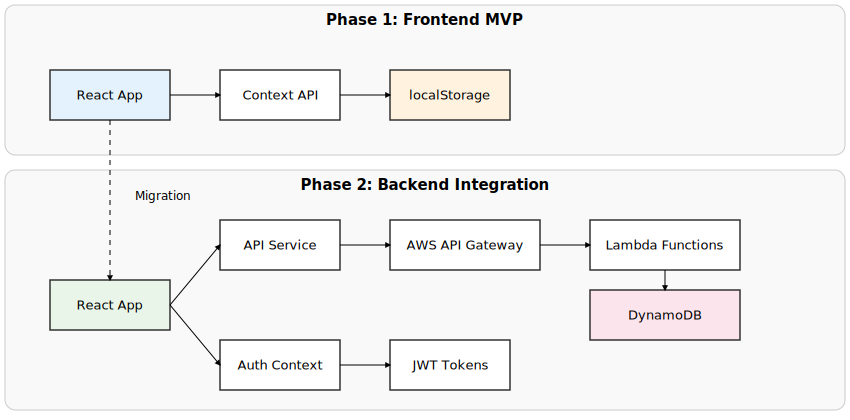

# TODO 웹 앱 설계문서

## 1. 문서 개요

### 1.1 목적
- TODO 웹 애플리케이션의 기술적 설계 명세
- 개발팀의 구현 가이드라인 제공
- 단계별 개발 전략에 따른 아키텍처 설계

### 1.2 범위
- 1단계: 프론트엔드 전용 MVP (localStorage 기반)
- 2단계: 백엔드 연동 확장 (AWS 서버리스)

### 1.3 기술 스택
- **모노레포 관리**: pnpm workspaces
- **프론트엔드**: React 18 + TypeScript + Tailwind CSS
- **UI Kit**: Shadcn/ui
- **빌드 도구**: Vite
- **상태 관리**: React Context + useReducer
- **테스트**: Jest + React Testing Library
- **배포**: GitHub Pages (1단계), AWS (2단계)

## 2. 시스템 아키텍처

### 2.1 전체 아키텍처 개요


### 2.2 1단계 아키텍처 (MVP)

```
Frontend Application
├── Presentation Layer (React Components)
├── Business Logic Layer (Custom Hooks)
├── State Management Layer (Context + Reducer)
└── Data Access Layer (localStorage Service)
```

### 2.3 2단계 확장 아키텍처

```
Frontend ◄─── HTTP/REST ────► Backend
    │                           │
    ├── API Service Layer       ├── API Gateway
    ├── Auth Context           ├── Lambda Functions
    └── Data Sync Manager      └── DynamoDB
```

#### 단계별 아키텍처 진화



## 3. 데이터 모델 설계

### 3.1 Todo 엔티티

```typescript
interface Todo {
  id: string;                    // UUID
  title: string;                // 할 일 제목 (필수)
  completed: boolean;           // 완료 상태
  priority: Priority;           // 우선순위
  createdAt: Date;             // 생성일시
  updatedAt: Date;             // 수정일시
  userId?: string;             // 사용자 ID (2단계에서 추가)
}

enum Priority {
  HIGH = 'high',
  MEDIUM = 'medium',
  LOW = 'low'
}
```

### 3.2 필터 및 정렬 타입

```typescript
enum FilterType {
  ALL = 'all',
  ACTIVE = 'active',
  COMPLETED = 'completed'
}

enum SortBy {
  CREATED_DATE = 'createdDate',
  PRIORITY = 'priority',
  TITLE = 'title'
}

interface TodoFilter {
  type: FilterType;
  sortBy: SortBy;
  sortOrder: 'asc' | 'desc';
}
```

### 3.3 애플리케이션 상태

```typescript
interface AppState {
  todos: Todo[];
  filter: TodoFilter;
  loading: boolean;
  error: string | null;
  user?: User; // 2단계에서 추가
}
```

## 4. 컴포넌트 설계

### 4.1 컴포넌트 계층 구조

```
App
├── Header
│   ├── Logo
│   └── UserInfo (2단계)
├── TodoContainer
│   ├── TodoInput
│   ├── TodoFilters
│   ├── TodoList
│   │   └── TodoItem
│   │       ├── TodoText
│   │       ├── PriorityBadge
│   │       └── TodoActions
│   └── TodoStats
└── Footer
```

#### 컴포넌트 구조 다이어그램


### 4.2 주요 컴포넌트 명세

#### 4.2.1 TodoInput 컴포넌트
```typescript
interface TodoInputProps {
  onAddTodo: (title: string, priority: Priority) => void;
  placeholder?: string;
}

// 책임:
// - 새 할 일 입력 받기
// - 우선순위 선택
// - 입력 검증
// - 엔터키/버튼 클릭으로 추가
```

#### 4.2.2 TodoItem 컴포넌트
```typescript
interface TodoItemProps {
  todo: Todo;
  onToggle: (id: string) => void;
  onDelete: (id: string) => void;
  onEdit: (id: string, title: string) => void;
}

// 책임:
// - 할 일 정보 표시
// - 완료 상태 토글
// - 인라인 편집 모드
// - 삭제 확인
```

#### 4.2.3 TodoFilters 컴포넌트
```typescript
interface TodoFiltersProps {
  currentFilter: TodoFilter;
  onFilterChange: (filter: TodoFilter) => void;
  todoCount: {
    total: number;
    active: number;
    completed: number;
  };
}

// 책임:
// - 필터 옵션 제공
// - 정렬 옵션 제공
// - 할 일 개수 표시
```

## 5. 상태 관리 설계

### 5.1 Context 구조

```typescript
interface TodoContextType {
  state: AppState;
  dispatch: React.Dispatch<TodoAction>;
  // 편의 메서드들
  addTodo: (title: string, priority: Priority) => void;
  toggleTodo: (id: string) => void;
  deleteTodo: (id: string) => void;
  editTodo: (id: string, title: string) => void;
  setFilter: (filter: TodoFilter) => void;
}
```

### 5.2 Reducer Actions

```typescript
type TodoAction =
  | { type: 'ADD_TODO'; payload: { title: string; priority: Priority } }
  | { type: 'TOGGLE_TODO'; payload: { id: string } }
  | { type: 'DELETE_TODO'; payload: { id: string } }
  | { type: 'EDIT_TODO'; payload: { id: string; title: string } }
  | { type: 'SET_FILTER'; payload: TodoFilter }
  | { type: 'SET_LOADING'; payload: boolean }
  | { type: 'SET_ERROR'; payload: string | null }
  | { type: 'LOAD_TODOS'; payload: Todo[] };
```

### 5.3 Custom Hooks

```typescript
// 비즈니스 로직을 캡슐화하는 커스텀 훅들
const useTodos = () => {
  // TodoContext 사용 및 편의 메서드 제공
};

const useLocalStorage = <T>(key: string, initialValue: T) => {
  // localStorage 동기화
};

const useTodoFilters = () => {
  // 필터링 및 정렬 로직
};
```

### 5.4 데이터 플로우 예시

#### 할 일 추가 플로우


#### 할 일 완료 토글 플로우


#### 할 일 삭제 플로우


#### 필터링 플로우


## 6. 데이터 레이어 설계

### 6.1 1단계: localStorage Service

```typescript
class LocalStorageService {
  private readonly TODOS_KEY = 'todos';

  async getTodos(): Promise<Todo[]> {
    // localStorage에서 todos 조회
  }

  async saveTodos(todos: Todo[]): Promise<void> {
    // localStorage에 todos 저장
  }

  async addTodo(todo: Omit<Todo, 'id' | 'createdAt' | 'updatedAt'>): Promise<Todo> {
    // 새 todo 추가
  }

  async updateTodo(id: string, updates: Partial<Todo>): Promise<Todo> {
    // todo 업데이트
  }

  async deleteTodo(id: string): Promise<void> {
    // todo 삭제
  }
}
```

### 6.2 2단계: API Service 추상화

```typescript
interface TodoRepository {
  getTodos(): Promise<Todo[]>;
  addTodo(todo: CreateTodoRequest): Promise<Todo>;
  updateTodo(id: string, updates: UpdateTodoRequest): Promise<Todo>;
  deleteTodo(id: string): Promise<void>;
}

// 구현체들
class LocalStorageRepository implements TodoRepository { ... }
class APIRepository implements TodoRepository { ... }
```

## 7. UI/UX 설계

### 7.1 UI Kit 활용
- **UI Kit**: Shadcn/ui
- **설치 및 설정**: `npx shadcn-ui@latest init` 명령어를 통해 프로젝트에 통합.
- **컴포넌트 활용**:
  - `Button`: 핵심 액션 버튼 (추가, 수정, 삭제)
  - `Input`: 할 일 텍스트 입력
  - `Checkbox`: 할 일 완료 상태 토글
  - `Select` / `RadioGroup`: 우선순위, 필터 선택
  - `Dialog`: 삭제 확인 등 모달 창
  - `Card`: Todo 항목 컨테이너
  - `Tooltip`: 아이콘 버튼 설명
- **테마**: `theme.css` 파일을 통해 프로젝트의 디자인 시스템에 맞게 색상, 폰트, 스타일을 커스터마이징하여 일관성을 유지.

### 7.2 반응형 브레이크포인트

```css
/* Mobile First Approach */
.container {
  @apply px-4;
}

/* Tablet */
@screen md {
  .container {
    @apply px-6 max-w-2xl mx-auto;
  }
}

/* Desktop */
@screen lg {
  .container {
    @apply px-8 max-w-4xl;
  }
}
```

### 7.3 컴포넌트 레이아웃

#### 7.3.1 모바일 레이아웃 (주 타겟)


#### 7.3.2 데스크톱 레이아웃


## 8. 성능 최적화 전략

### 8.1 React 최적화
- `React.memo`로 불필요한 리렌더링 방지
- `useMemo`/`useCallback`으로 연산 최적화
- Virtual scrolling (할 일이 많을 때)

### 8.2 번들 최적화
- Code splitting으로 초기 로딩 시간 단축
- Tree shaking으로 불필요한 코드 제거
- 이미지 최적화 (WebP 포맷 사용)

### 8.3 사용자 경험 최적화
- Optimistic updates (즉시 UI 반영)
- Loading states와 skeleton UI
- 에러 boundary로 안정성 확보

## 9. 테스트 전략

### 9.1 테스트 피라미드

```
┌─────────────────┐
│   E2E Tests     │  ← 핵심 사용자 플로우
├─────────────────┤
│ Integration     │  ← 컴포넌트 간 상호작용
│    Tests        │
├─────────────────┤
│   Unit Tests    │  ← 개별 함수/컴포넌트
└─────────────────┘
```

### 9.2 테스트 커버리지 목표
- Unit Tests: 90% 이상
- Integration Tests: 주요 플로우 커버
- E2E Tests: 핵심 사용자 시나리오

### 9.3 TDD 개발 프로세스
1. **Red**: 실패하는 테스트 작성
2. **Green**: 테스트를 통과하는 최소 코드 작성
3. **Refactor**: 코드 개선 및 최적화

## 10. 보안 고려사항

### 10.1 1단계 (localStorage)
- XSS 공격 방지를 위한 입력 검증
- Content Security Policy (CSP) 설정

### 10.2 2단계 (백엔드 연동)
- JWT 토큰 기반 인증
- HTTPS 통신 강제
- API Rate limiting
- 입력 데이터 검증 및 sanitization

## 11. 확장성 고려사항

### 11.1 아키텍처 확장성
- Repository 패턴으로 데이터 레이어 추상화
- Context 분리로 관심사 분리
- 컴포넌트 재사용성 고려

### 11.2 기능 확장 계획
- 태그/카테고리 시스템
- 파일 첨부 기능
- 협업 기능 (공유, 댓글)
- 알림 시스템

## 12. 개발 가이드라인

### 12.1 코딩 컨벤션
- ESLint + Prettier 설정
- TypeScript strict 모드 사용
- 컴포넌트명: PascalCase
- 파일명: kebab-case
- 함수명: camelCase

### 12.2 Git 워크플로우
- Feature branch 전략
- Conventional Commits 사용
- PR 리뷰 필수
- 자동화된 테스트 통과 후 머지

### 12.3 폴더 구조
```
/ (root)
├── apps/
│   ├── client/             # React 프론트엔드 (Vite)
│   │   ├── src/
│   │   │   ├── components/   # 클라이언트 전용 컴포넌트
│   │   │   ├── contexts/
│   │   │   └── App.tsx
│   │   ├── package.json
│   │   └── vite.config.ts
│   └── server/             # 백엔드 (AWS Lambda)
│       ├── src/
│       │   ├── functions/  # Lambda 핸들러 (예: get-todos.ts)
│       │   └── utils/
│       └── package.json
├── packages/
│   ├── ui/                 # 공유 UI 컴포넌트 (Shadcn/ui)
│   │   ├── button.tsx      # 예: packages/ui/button.tsx
│   │   └── card.tsx
│   └── types/              # 공유 TypeScript 타입
│       └── index.ts        # 예: export interface Todo { ... }
├── node_modules/
├── package.json            # 전체 프로젝트 관리 (pnpm-workspace)
└── pnpm-workspace.yaml     # pnpm 워크스페이스 설정
```

---

**작성일**: 2025년 07월 18일  
**작성자**: 개발팀  
**버전**: 1.0  
**검토자**: - 