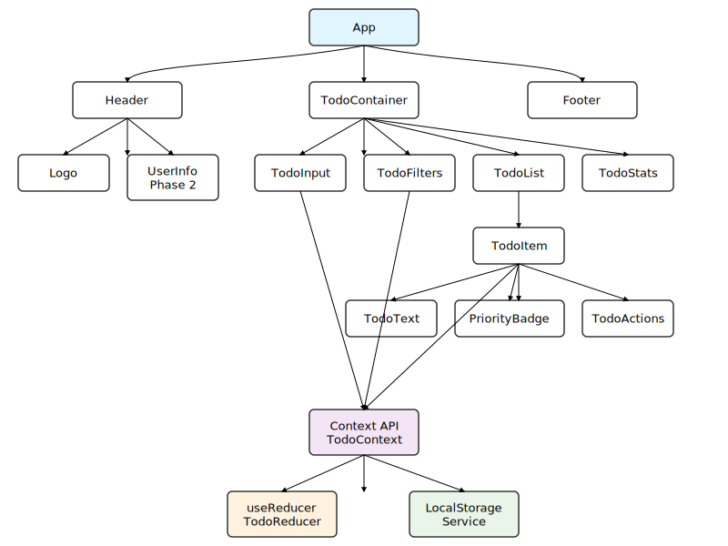

# 4. 컴포넌트 설계

## 4.1 컴포넌트 계층 구조

```
App
├── Header
│   ├── Logo
│   └── UserInfo (2단계)
├── TodoContainer
│   ├── TodoInput
│   ├── TodoFilters
│   ├── TodoList
│   │   └── TodoItem
│   │       ├── TodoText
│   │       ├── PriorityBadge
│   │       └── TodoActions
│   └── TodoStats
└── Footer
```

## 4.2 컴포넌트 구조 다이어그램



## 4.3 주요 컴포넌트 명세

### 4.3.1 TodoInput 컴포넌트
```typescript
interface TodoInputProps {
  onAddTodo: (title: string, priority: Priority) => void;
  placeholder?: string;
}

// 책임:
// - 새 할 일 입력 받기
// - 우선순위 선택
// - 입력 검증
// - 엔터키/버튼 클릭으로 추가
```

### 4.3.2 TodoItem 컴포넌트
```typescript
interface TodoItemProps {
  todo: Todo;
  onToggle: (id: string) => void;
  onDelete: (id: string) => void;
  onEdit: (id: string, title: string) => void;
}

// 책임:
// - 할 일 정보 표시
// - 완료 상태 토글
// - 인라인 편집 모드
// - 삭제 확인
```

### 4.3.3 TodoFilters 컴포넌트
```typescript
interface TodoFiltersProps {
  currentFilter: TodoFilter;
  onFilterChange: (filter: TodoFilter) => void;
  todoCount: {
    total: number;
    active: number;
    completed: number;
  };
}

// 책임:
// - 필터 옵션 제공
// - 정렬 옵션 제공
// - 할 일 개수 표시
```

### 4.3.4 TodoList 컴포넌트
```typescript
interface TodoListProps {
  todos: Todo[];
  filter: TodoFilter;
  onToggle: (id: string) => void;
  onDelete: (id: string) => void;
  onEdit: (id: string, title: string) => void;
}

// 책임:
// - 필터된 할 일 목록 렌더링
// - 빈 상태 처리
// - 로딩 상태 표시
// - 가상 스크롤링 (성능 최적화)
```

### 4.3.5 TodoStats 컴포넌트
```typescript
interface TodoStatsProps {
  todos: Todo[];
  filter: TodoFilter;
}

// 책임:
// - 전체/완료/미완료 개수 표시
// - 완료율 표시
// - 우선순위별 통계
```

### 4.3.6 Header 컴포넌트
```typescript
interface HeaderProps {
  user?: User; // 2단계에서 추가
}

// 책임:
// - 애플리케이션 제목 표시
// - 사용자 정보 표시 (2단계)
// - 로그인/로그아웃 버튼 (2단계)
```

## 4.4 공통 컴포넌트

### 4.4.1 PriorityBadge 컴포넌트
```typescript
interface PriorityBadgeProps {
  priority: Priority;
  size?: 'sm' | 'md' | 'lg';
}

// 책임:
// - 우선순위 시각적 표시
// - 색상 및 아이콘 매핑
// - 접근성 지원
```

### 4.4.2 ConfirmDialog 컴포넌트
```typescript
interface ConfirmDialogProps {
  isOpen: boolean;
  title: string;
  message: string;
  confirmText?: string;
  cancelText?: string;
  onConfirm: () => void;
  onCancel: () => void;
}

// 책임:
// - 삭제 확인 다이얼로그
// - 키보드 접근성 지원
// - ESC 키로 취소
```

## 4.5 컴포넌트 최적화 전략

### 4.5.1 React.memo 적용
- TodoItem: props가 변경되지 않으면 리렌더링 방지
- PriorityBadge: 우선순위가 동일하면 리렌더링 방지
- TodoStats: 통계 데이터가 동일하면 리렌더링 방지

### 4.5.2 useCallback 활용
- 이벤트 핸들러 함수들을 메모이제이션
- 부모에서 자식으로 전달되는 콜백 함수 최적화

### 4.5.3 가상 스크롤링
- 많은 할 일 항목이 있을 때 성능 최적화
- react-window 또는 react-virtualized 활용

---

**이전**: [데이터 모델](03-data-models.md)  
**다음**: [상태 관리 설계](05-state-management.md)