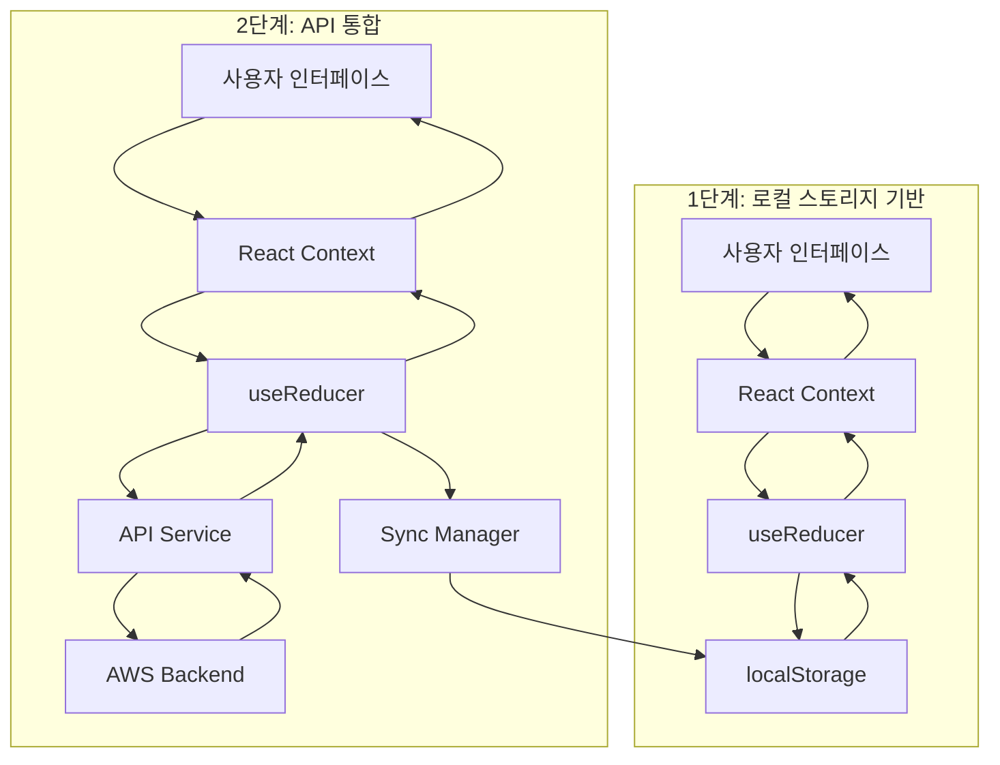
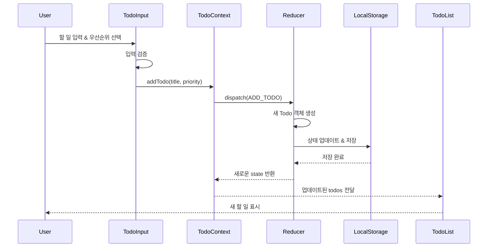
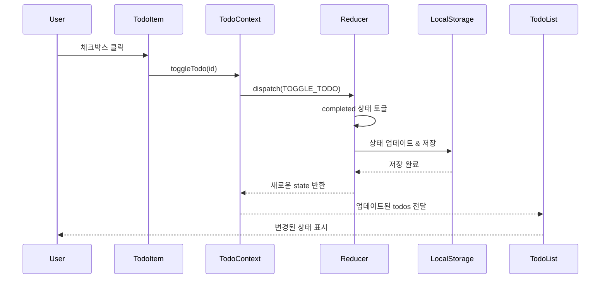
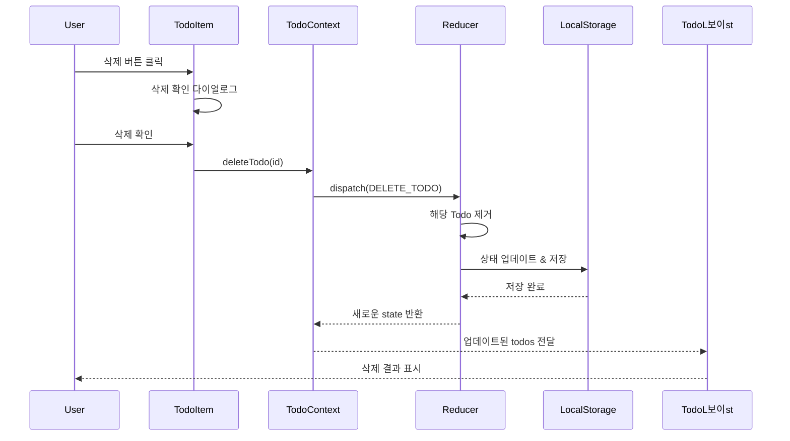
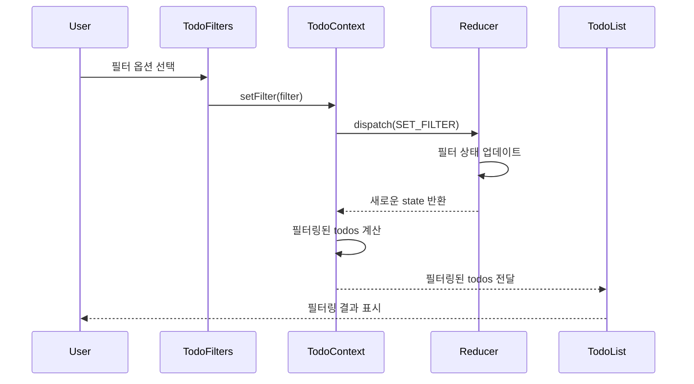
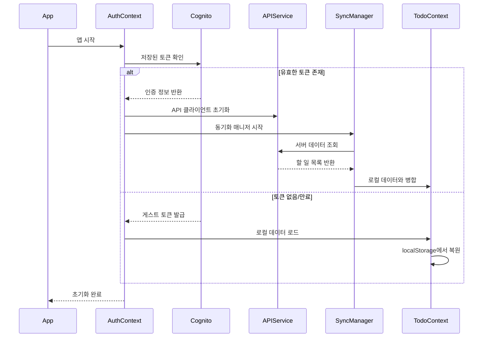
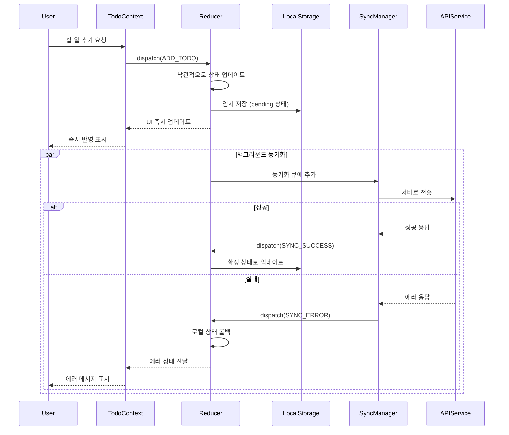
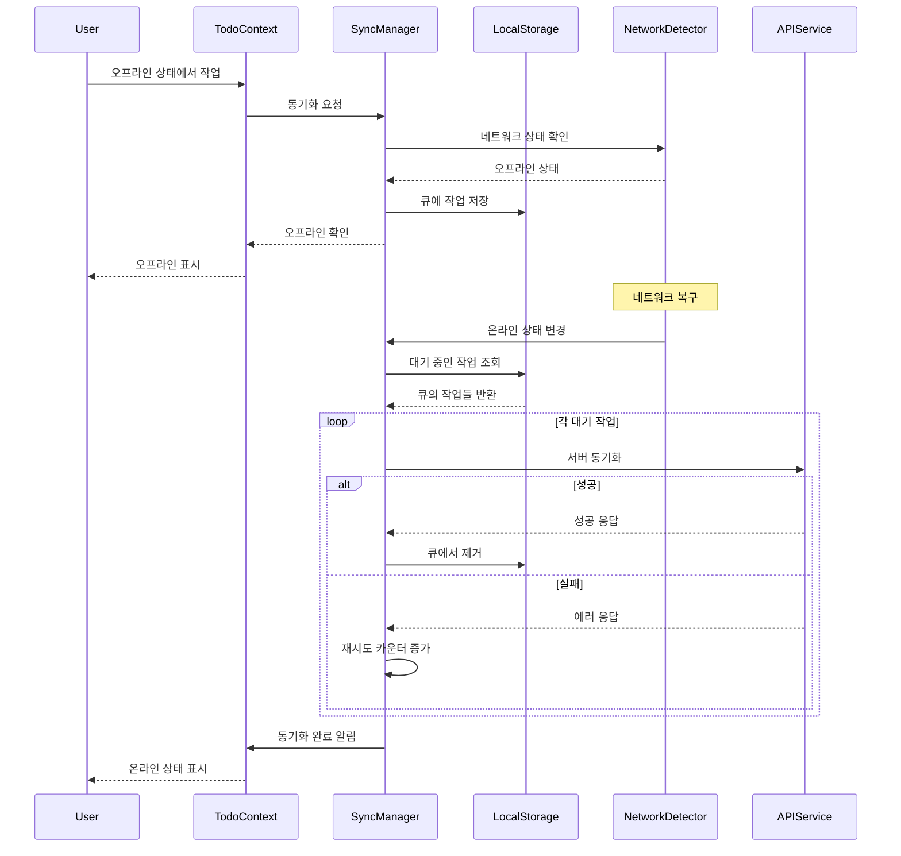
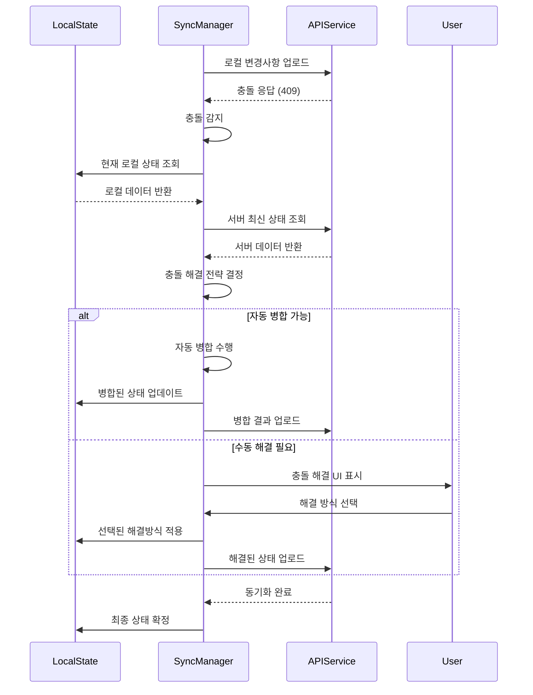
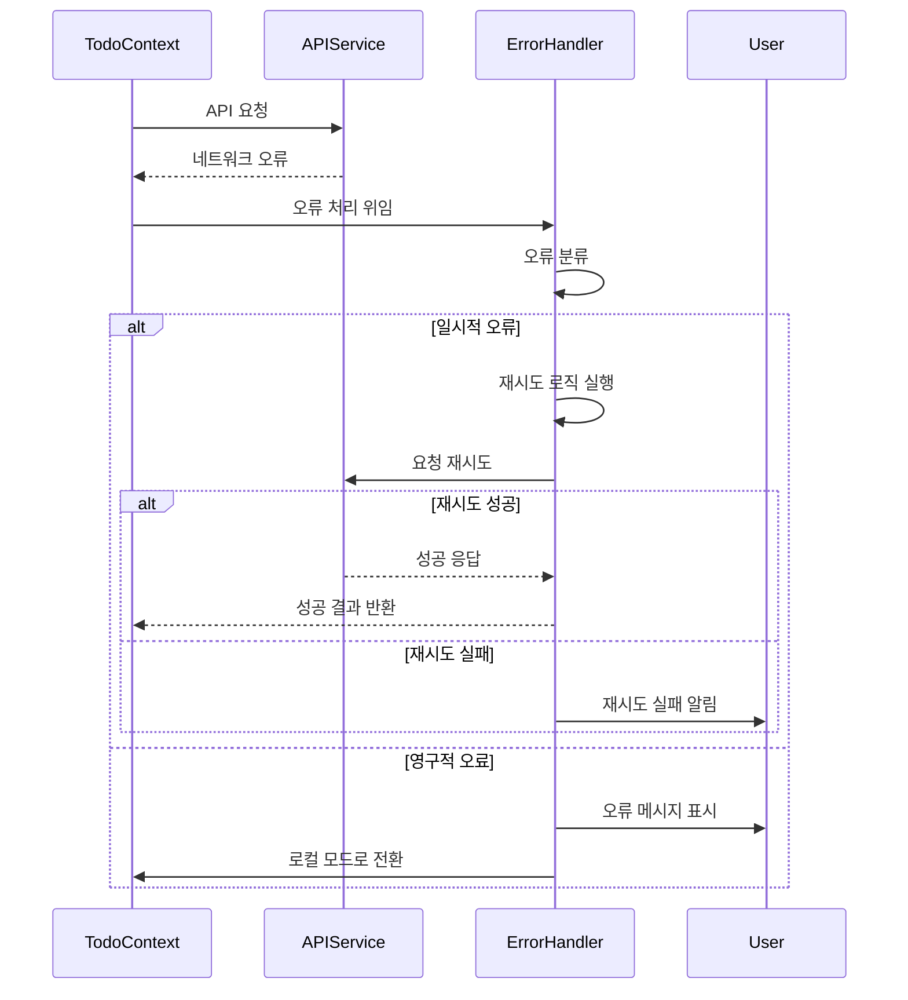

# 6. 데이터 플로우 설계

## 6.1 전체 데이터 플로우 개요

## 6.2 1단계 데이터 플로우 (MVP)

### 6.2.1 할 일 추가 플로우

### 6.2.2 할 일 완료 토글 플로우

### 6.2.3 할 일 삭제 플로우

### 6.2.4 필터링 플로우

## 6.3 2단계 데이터 플로우 (API 통합)

### 6.3.1 앱 초기화 플로우

### 6.3.2 낙관적 업데이트 플로우

### 6.3.3 오프라인 동기화 플로우

### 6.3.4 충돌 해결 플로우

## 6.4 에러 처리 플로우

### 6.4.1 네트워크 오류 처리

---

**이전**: [상태 관리 설계](05-state-management.md)  
**다음**: [API 설계](07-api-design.md)
