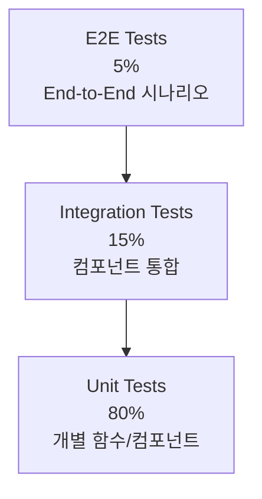

# 10. 테스트 전략 및 품질 보증

## 10.1 테스트 전략 개요

### 10.1.1 테스트 피라미드



### 10.1.2 단계별 테스트 전략

**1단계 (MVP - localStorage 기반)**
- Unit Tests: 비즈니스 로직, 유틸리티 함수
- Component Tests: React 컴포넌트
- Integration Tests: Context + Reducer + localStorage
- E2E Tests: 주요 사용자 플로우

**2단계 (API 통합)**
- API Tests: 백엔드 API 엔드포인트
- Contract Tests: API 계약 검증
- Performance Tests: 로드 테스트
- Security Tests: 보안 취약점 검사

## 10.2 단위 테스트 (Unit Tests)

### 10.2.1 백엔드 단위 테스트 (TDD 방식)

```typescript
// apps/server/src/services/__tests__/todo.service.test.ts
import { TodoService } from '../todo.service';
import { DynamoTodoRepository } from '../repositories/dynamo-todo.repository';
import { Logger } from '../utils/logger';

describe('TodoService', () => {
  let todoService: TodoService;
  let mockRepository: jest.Mocked<DynamoTodoRepository>;
  let mockLogger: jest.Mocked<Logger>;

  beforeEach(() => {
    mockRepository = {
      create: jest.fn(),
      findById: jest.fn(),
      findAll: jest.fn(),
      update: jest.fn(),
      delete: jest.fn(),
      getUserQuota: jest.fn(),
    } as jest.Mocked<DynamoTodoRepository>;

    mockLogger = {
      info: jest.fn(),
      warn: jest.fn(),
      error: jest.fn(),
    } as jest.Mocked<Logger>;

    todoService = new TodoService(mockRepository, mockLogger);
  });

  describe('createTodo', () => {
    it('should create a new todo with valid data', async () => {
      // Given
      const userId = 'user-123';
      const todoData = {
        title: 'Test Todo',
        priority: 'high' as Priority,
      };
      const expectedTodo: Todo = {
        id: 'todo-123',
        ...todoData,
        completed: false,
        userId,
        isGuest: false,
        createdAt: '2024-01-15T10:00:00Z',
        updatedAt: '2024-01-15T10:00:00Z',
      };

      mockRepository.create.mockResolvedValue(expectedTodo);
      mockRepository.getUserQuota.mockResolvedValue({
        currentCount: 5,
        maxItems: 1000,
      });

      // When
      const result = await todoService.createTodo(userId, todoData);

      // Then
      expect(result).toEqual(expectedTodo);
      expect(mockRepository.create).toHaveBeenCalledWith({
        ...todoData,
        userId,
      });
      expect(mockLogger.info).toHaveBeenCalledWith(
        'Todo created',
        { todoId: expectedTodo.id, userId }
      );
    });

    it('should throw error when user exceeds quota', async () => {
      // Given
      const userId = 'guest-session-123';
      const todoData = {
        title: 'Test Todo',
        priority: 'high' as Priority,
      };

      mockRepository.getUserQuota.mockResolvedValue({
        currentCount: 10,
        maxItems: 10,
      });

      // When & Then
      await expect(
        todoService.createTodo(userId, todoData)
      ).rejects.toThrow('Maximum todo limit reached');

      expect(mockRepository.create).not.toHaveBeenCalled();
    });

    it('should handle repository errors gracefully', async () => {
      // Given
      const userId = 'user-123';
      const todoData = {
        title: 'Test Todo',
        priority: 'high' as Priority,
      };

      mockRepository.getUserQuota.mockResolvedValue({
        currentCount: 5,
        maxItems: 1000,
      });
      mockRepository.create.mockRejectedValue(new Error('Database error'));

      // When & Then
      await expect(
        todoService.createTodo(userId, todoData)
      ).rejects.toThrow('Database error');

      expect(mockLogger.error).toHaveBeenCalled();
    });
  });

  describe('toggleTodo', () => {
    it('should toggle todo completion status', async () => {
      // Given
      const userId = 'user-123';
      const todoId = 'todo-123';
      const existingTodo: Todo = {
        id: todoId,
        title: 'Test Todo',
        priority: 'medium',
        completed: false,
        userId,
        isGuest: false,
        createdAt: '2024-01-15T10:00:00Z',
        updatedAt: '2024-01-15T10:00:00Z',
      };
      const updatedTodo = { ...existingTodo, completed: true };

      mockRepository.findById.mockResolvedValue(existingTodo);
      mockRepository.update.mockResolvedValue(updatedTodo);

      // When
      const result = await todoService.toggleTodo(userId, todoId);

      // Then
      expect(result).toEqual(updatedTodo);
      expect(mockRepository.update).toHaveBeenCalledWith(
        userId,
        todoId,
        { completed: true }
      );
    });

    it('should throw error when todo not found', async () => {
      // Given
      const userId = 'user-123';
      const todoId = 'non-existent';

      mockRepository.findById.mockResolvedValue(null);

      // When & Then
      await expect(
        todoService.toggleTodo(userId, todoId)
      ).rejects.toThrow('Todo not found');
    });
  });
});
```

### 10.2.2 프론트엔드 단위 테스트

```typescript
// apps/client/src/hooks/__tests__/useTodos.test.ts
import { renderHook, act } from '@testing-library/react';
import { useTodos } from '../useTodos';
import { TodoProvider } from '../../contexts/TodoContext';
import { Todo, Priority } from '@hanbit/types';

const wrapper = ({ children }: { children: React.ReactNode }) => (
  <TodoProvider>{children}</TodoProvider>
);

describe('useTodos', () => {
  beforeEach(() => {
    localStorage.clear();
  });

  it('should initialize with empty todos', () => {
    // When
    const { result } = renderHook(() => useTodos(), { wrapper });

    // Then
    expect(result.current.todos).toEqual([]);
    expect(result.current.loading).toBe(false);
    expect(result.current.error).toBeNull();
  });

  it('should add a new todo', async () => {
    // Given
    const { result } = renderHook(() => useTodos(), { wrapper });
    const title = 'New Todo';
    const priority: Priority = 'high';

    // When
    await act(async () => {
      result.current.addTodo(title, priority);
    });

    // Then
    expect(result.current.todos).toHaveLength(1);
    expect(result.current.todos[0]).toMatchObject({
      title,
      priority,
      completed: false,
    });
    expect(result.current.todos[0].id).toBeDefined();
  });

  it('should toggle todo completion', async () => {
    // Given
    const { result } = renderHook(() => useTodos(), { wrapper });
    
    await act(async () => {
      result.current.addTodo('Test Todo', 'medium');
    });

    const todoId = result.current.todos[0].id;

    // When
    await act(async () => {
      result.current.toggleTodo(todoId);
    });

    // Then
    expect(result.current.todos[0].completed).toBe(true);
  });

  it('should filter todos correctly', async () => {
    // Given
    const { result } = renderHook(() => useTodos(), { wrapper });
    
    await act(async () => {
      result.current.addTodo('Todo 1', 'high');
      result.current.addTodo('Todo 2', 'medium');
    });

    const todoId = result.current.todos[0].id;
    
    await act(async () => {
      result.current.toggleTodo(todoId);
    });

    // When - Filter active todos
    await act(async () => {
      result.current.setFilter({
        type: 'active',
        sortBy: 'createdDate',
        sortOrder: 'desc',
      });
    });

    // Then
    expect(result.current.todos).toHaveLength(1);
    expect(result.current.todos[0].completed).toBe(false);
  });

  it('should persist todos to localStorage', async () => {
    // Given
    const { result } = renderHook(() => useTodos(), { wrapper });

    // When
    await act(async () => {
      result.current.addTodo('Persistent Todo', 'low');
    });

    // Then
    const storedTodos = JSON.parse(localStorage.getItem('todos') || '[]');
    expect(storedTodos).toHaveLength(1);
    expect(storedTodos[0].title).toBe('Persistent Todo');
  });
});
```

## 10.3 컴포넌트 테스트

### 10.3.1 React 컴포넌트 테스트

```typescript
// apps/client/src/components/__tests__/TodoItem.test.tsx
import { render, screen, fireEvent } from '@testing-library/react';
import userEvent from '@testing-library/user-event';
import { TodoItem } from '../TodoItem';
import { Todo } from '@hanbit/types';

const mockTodo: Todo = {
  id: 'todo-123',
  title: 'Test Todo',
  priority: 'high',
  completed: false,
  userId: 'user-123',
  isGuest: false,
  createdAt: '2024-01-15T10:00:00Z',
  updatedAt: '2024-01-15T10:00:00Z',
};

describe('TodoItem', () => {
  const mockOnToggle = jest.fn();
  const mockOnDelete = jest.fn();
  const mockOnEdit = jest.fn();

  beforeEach(() => {
    jest.clearAllMocks();
  });

  it('should render todo item correctly', () => {
    // Given & When
    render(
      <TodoItem
        todo={mockTodo}
        onToggle={mockOnToggle}
        onDelete={mockOnDelete}
        onEdit={mockOnEdit}
      />
    );

    // Then
    expect(screen.getByText('Test Todo')).toBeInTheDocument();
    expect(screen.getByRole('checkbox')).not.toBeChecked();
    expect(screen.getByText('high')).toBeInTheDocument();
  });

  it('should call onToggle when checkbox is clicked', async () => {
    // Given
    const user = userEvent.setup();
    render(
      <TodoItem
        todo={mockTodo}
        onToggle={mockOnToggle}
        onDelete={mockOnDelete}
        onEdit={mockOnEdit}
      />
    );

    // When
    await user.click(screen.getByRole('checkbox'));

    // Then
    expect(mockOnToggle).toHaveBeenCalledWith('todo-123');
  });

  it('should show completed state correctly', () => {
    // Given
    const completedTodo = { ...mockTodo, completed: true };

    // When
    render(
      <TodoItem
        todo={completedTodo}
        onToggle={mockOnToggle}
        onDelete={mockOnDelete}
        onEdit={mockOnEdit}
      />
    );

    // Then
    expect(screen.getByRole('checkbox')).toBeChecked();
    expect(screen.getByText('Test Todo')).toHaveClass('line-through');
  });

  it('should enter edit mode when edit button is clicked', async () => {
    // Given
    const user = userEvent.setup();
    render(
      <TodoItem
        todo={mockTodo}
        onToggle={mockOnToggle}
        onDelete={mockOnDelete}
        onEdit={mockOnEdit}
      />
    );

    // When
    await user.click(screen.getByRole('button', { name: /edit/i }));

    // Then
    expect(screen.getByRole('textbox')).toBeInTheDocument();
    expect(screen.getByRole('textbox')).toHaveValue('Test Todo');
  });

  it('should save edited todo when enter is pressed', async () => {
    // Given
    const user = userEvent.setup();
    render(
      <TodoItem
        todo={mockTodo}
        onToggle={mockOnToggle}
        onDelete={mockOnDelete}
        onEdit={mockOnEdit}
      />
    );

    await user.click(screen.getByRole('button', { name: /edit/i }));
    const input = screen.getByRole('textbox');

    // When
    await user.clear(input);
    await user.type(input, 'Updated Todo');
    await user.keyboard('{Enter}');

    // Then
    expect(mockOnEdit).toHaveBeenCalledWith('todo-123', 'Updated Todo');
  });

  it('should show delete confirmation dialog', async () => {
    // Given
    const user = userEvent.setup();
    render(
      <TodoItem
        todo={mockTodo}
        onToggle={mockOnToggle}
        onDelete={mockOnDelete}
        onEdit={mockOnEdit}
      />
    );

    // When
    await user.click(screen.getByRole('button', { name: /delete/i }));

    // Then
    expect(screen.getByRole('dialog')).toBeInTheDocument();
    expect(screen.getByText(/confirm delete/i)).toBeInTheDocument();
  });

  it('should delete todo when confirmed', async () => {
    // Given
    const user = userEvent.setup();
    render(
      <TodoItem
        todo={mockTodo}
        onToggle={mockOnToggle}
        onDelete={mockOnDelete}
        onEdit={mockOnEdit}
      />
    );

    await user.click(screen.getByRole('button', { name: /delete/i }));

    // When
    await user.click(screen.getByRole('button', { name: /confirm/i }));

    // Then
    expect(mockOnDelete).toHaveBeenCalledWith('todo-123');
  });
});
```

## 10.4 통합 테스트 (Integration Tests)

### 10.4.1 API 통합 테스트

```typescript
// apps/server/src/__tests__/integration/todos.integration.test.ts
import { APIGatewayProxyEvent, Context } from 'aws-lambda';
import { handler as getTodosHandler } from '../../handlers/get-todos';
import { handler as createTodoHandler } from '../../handlers/create-todo';
import { DynamoDBClient } from '@aws-sdk/client-dynamodb';
import { TestContainer } from '../utils/test-container';

describe('Todos API Integration', () => {
  let testContainer: TestContainer;
  let dynamoClient: DynamoDBClient;

  beforeAll(async () => {
    testContainer = new TestContainer();
    await testContainer.setup();
    dynamoClient = testContainer.getDynamoClient();
  });

  afterAll(async () => {
    await testContainer.teardown();
  });

  beforeEach(async () => {
    await testContainer.clearTables();
  });

  describe('GET /todos', () => {
    it('should return empty array for new user', async () => {
      // Given
      const event = createAPIGatewayEvent('GET', '/todos', null, {
        userId: 'user-123',
        userType: 'authenticated',
      });

      // When
      const response = await getTodosHandler(event, {} as Context);

      // Then
      expect(response.statusCode).toBe(200);
      const body = JSON.parse(response.body);
      expect(body.success).toBe(true);
      expect(body.data.todos).toEqual([]);
    });

    it('should return user todos with pagination', async () => {
      // Given
      const userId = 'user-123';
      await createTestTodos(dynamoClient, userId, 25);

      const event = createAPIGatewayEvent('GET', '/todos?limit=10', null, {
        userId,
        userType: 'authenticated',
      });

      // When
      const response = await getTodosHandler(event, {} as Context);

      // Then
      expect(response.statusCode).toBe(200);
      const body = JSON.parse(response.body);
      expect(body.success).toBe(true);
      expect(body.data.todos).toHaveLength(10);
      expect(body.data.pagination.hasNextPage).toBe(true);
      expect(body.data.pagination.totalCount).toBe(25);
    });
  });

  describe('POST /todos', () => {
    it('should create a new todo', async () => {
      // Given
      const todoData = {
        title: 'Integration Test Todo',
        priority: 'high',
      };
      const event = createAPIGatewayEvent('POST', '/todos', todoData, {
        userId: 'user-123',
        userType: 'authenticated',
      });

      // When
      const response = await createTodoHandler(event, {} as Context);

      // Then
      expect(response.statusCode).toBe(201);
      const body = JSON.parse(response.body);
      expect(body.success).toBe(true);
      expect(body.data.todo).toMatchObject({
        title: 'Integration Test Todo',
        priority: 'high',
        completed: false,
      });
      expect(body.data.todo.id).toBeDefined();
    });

    it('should reject invalid todo data', async () => {
      // Given
      const invalidData = {
        title: '', // Empty title should be rejected
        priority: 'invalid-priority',
      };
      const event = createAPIGatewayEvent('POST', '/todos', invalidData, {
        userId: 'user-123',
        userType: 'authenticated',
      });

      // When
      const response = await createTodoHandler(event, {} as Context);

      // Then
      expect(response.statusCode).toBe(400);
      const body = JSON.parse(response.body);
      expect(body.success).toBe(false);
      expect(body.error.code).toBe('VALIDATION_ERROR');
    });

    it('should enforce guest user quota', async () => {
      // Given
      const guestUserId = 'guest-session-123';
      await createTestTodos(dynamoClient, guestUserId, 10); // Max guest todos

      const todoData = {
        title: 'Quota Exceeded Todo',
        priority: 'medium',
      };
      const event = createAPIGatewayEvent('POST', '/todos', todoData, {
        userId: guestUserId,
        userType: 'guest',
        permissions: JSON.stringify({ maxItems: 10 }),
      });

      // When
      const response = await createTodoHandler(event, {} as Context);

      // Then
      expect(response.statusCode).toBe(403);
      const body = JSON.parse(response.body);
      expect(body.success).toBe(false);
      expect(body.error.code).toBe('QUOTA_EXCEEDED');
    });
  });
});

// Helper functions
function createAPIGatewayEvent(
  httpMethod: string,
  path: string,
  body: any,
  authorizer: any
): APIGatewayProxyEvent {
  return {
    httpMethod,
    path,
    resource: path,
    body: body ? JSON.stringify(body) : null,
    headers: {},
    queryStringParameters: null,
    pathParameters: null,
    requestContext: {
      authorizer,
    } as any,
  } as APIGatewayProxyEvent;
}

async function createTestTodos(
  dynamoClient: DynamoDBClient,
  userId: string,
  count: number
): Promise<void> {
  // Implementation to create test todos in DynamoDB
}
```

## 10.5 End-to-End 테스트

### 10.5.1 Playwright E2E 테스트

```typescript
// apps/client/e2e/todo-flow.spec.ts
import { test, expect } from '@playwright/test';

test.describe('Todo Application E2E', () => {
  test.beforeEach(async ({ page }) => {
    await page.goto('/');
    // Clear localStorage
    await page.evaluate(() => localStorage.clear());
  });

  test('should complete full todo lifecycle', async ({ page }) => {
    // Add a new todo
    await page.fill('[data-testid="todo-input"]', 'Buy groceries');
    await page.selectOption('[data-testid="priority-select"]', 'high');
    await page.click('[data-testid="add-todo-button"]');

    // Verify todo appears in list
    await expect(page.locator('[data-testid="todo-item"]')).toContainText('Buy groceries');
    await expect(page.locator('[data-testid="priority-badge"]')).toContainText('high');

    // Mark todo as completed
    await page.click('[data-testid="todo-checkbox"]');
    await expect(page.locator('[data-testid="todo-title"]')).toHaveClass(/line-through/);

    // Edit todo
    await page.click('[data-testid="edit-button"]');
    await page.fill('[data-testid="edit-input"]', 'Buy organic groceries');
    await page.keyboard.press('Enter');
    await expect(page.locator('[data-testid="todo-item"]')).toContainText('Buy organic groceries');

    // Delete todo
    await page.click('[data-testid="delete-button"]');
    await page.click('[data-testid="confirm-delete"]');
    await expect(page.locator('[data-testid="todo-item"]')).toHaveCount(0);
  });

  test('should filter todos correctly', async ({ page }) => {
    // Add multiple todos
    const todos = [
      { title: 'Active Todo', priority: 'medium' },
      { title: 'Completed Todo', priority: 'low' },
      { title: 'High Priority Todo', priority: 'high' },
    ];

    for (const todo of todos) {
      await page.fill('[data-testid="todo-input"]', todo.title);
      await page.selectOption('[data-testid="priority-select"]', todo.priority);
      await page.click('[data-testid="add-todo-button"]');
    }

    // Complete one todo
    await page.locator('[data-testid="todo-item"]').nth(1).locator('[data-testid="todo-checkbox"]').click();

    // Filter active todos
    await page.click('[data-testid="filter-active"]');
    await expect(page.locator('[data-testid="todo-item"]')).toHaveCount(2);

    // Filter completed todos
    await page.click('[data-testid="filter-completed"]');
    await expect(page.locator('[data-testid="todo-item"]')).toHaveCount(1);
    await expect(page.locator('[data-testid="todo-item"]')).toContainText('Completed Todo');

    // Show all todos
    await page.click('[data-testid="filter-all"]');
    await expect(page.locator('[data-testid="todo-item"]')).toHaveCount(3);
  });

  test('should persist todos after page reload', async ({ page }) => {
    // Add a todo
    await page.fill('[data-testid="todo-input"]', 'Persistent Todo');
    await page.click('[data-testid="add-todo-button"]');

    // Reload page
    await page.reload();

    // Verify todo persists
    await expect(page.locator('[data-testid="todo-item"]')).toContainText('Persistent Todo');
  });

  test('should handle empty state correctly', async ({ page }) => {
    // Verify empty state message
    await expect(page.locator('[data-testid="empty-state"]')).toBeVisible();
    await expect(page.locator('[data-testid="empty-state"]')).toContainText('No todos yet');

    // Add a todo
    await page.fill('[data-testid="todo-input"]', 'First Todo');
    await page.click('[data-testid="add-todo-button"]');

    // Verify empty state disappears
    await expect(page.locator('[data-testid="empty-state"]')).not.toBeVisible();
  });

  test('should validate input correctly', async ({ page }) => {
    // Try to add empty todo
    await page.click('[data-testid="add-todo-button"]');
    await expect(page.locator('[data-testid="error-message"]')).toContainText('Title is required');

    // Try to add todo with only whitespace
    await page.fill('[data-testid="todo-input"]', '   ');
    await page.click('[data-testid="add-todo-button"]');
    await expect(page.locator('[data-testid="error-message"]')).toContainText('Title is required');

    // Add valid todo
    await page.fill('[data-testid="todo-input"]', 'Valid Todo');
    await page.click('[data-testid="add-todo-button"]');
    await expect(page.locator('[data-testid="error-message"]')).not.toBeVisible();
  });
});
```

## 10.6 성능 테스트

### 10.6.1 로드 테스트 (Artillery)

```yaml
# performance/load-test.yml
config:
  target: 'https://api.todo-app.example.com'
  phases:
    - duration: 60
      arrivalRate: 5
      name: "Warm up"
    - duration: 300
      arrivalRate: 20
      name: "Load test"
    - duration: 120
      arrivalRate: 50
      name: "Spike test"

scenarios:
  - name: "Todo CRUD Operations"
    weight: 80
    flow:
      - post:
          url: "/auth/guest"
          capture:
            - json: "$.data.guestToken"
              as: "authToken"
      - post:
          url: "/todos"
          headers:
            Authorization: "Bearer {{ authToken }}"
          json:
            title: "Load Test Todo {{ $randomString() }}"
            priority: "{{ $randomItem(['high', 'medium', 'low']) }}"
          capture:
            - json: "$.data.todo.id"
              as: "todoId"
      - get:
          url: "/todos"
          headers:
            Authorization: "Bearer {{ authToken }}"
      - put:
          url: "/todos/{{ todoId }}"
          headers:
            Authorization: "Bearer {{ authToken }}"
          json:
            completed: true
      - delete:
          url: "/todos/{{ todoId }}"
          headers:
            Authorization: "Bearer {{ authToken }}"

  - name: "Read Heavy Operations"
    weight: 20
    flow:
      - post:
          url: "/auth/guest"
          capture:
            - json: "$.data.guestToken"
              as: "authToken"
      - loop:
          - get:
              url: "/todos"
              headers:
                Authorization: "Bearer {{ authToken }}"
        count: 10
```

### 10.6.2 성능 테스트 스크립트

```typescript
// performance/performance.test.ts
import { performance } from 'perf_hooks';
import { TodoService } from '../apps/server/src/services/todo.service';

describe('Performance Tests', () => {
  let todoService: TodoService;

  beforeAll(() => {
    // Setup test service with real DynamoDB (test environment)
    todoService = new TodoService(/* real dependencies */);
  });

  test('should handle 1000 todo creations within 5 seconds', async () => {
    const userId = 'perf-test-user';
    const startTime = performance.now();
    
    const promises = Array.from({ length: 1000 }, (_, i) =>
      todoService.createTodo(userId, {
        title: `Performance Test Todo ${i}`,
        priority: 'medium',
      })
    );

    await Promise.all(promises);
    
    const endTime = performance.now();
    const duration = endTime - startTime;
    
    expect(duration).toBeLessThan(5000); // 5 seconds
  });

  test('should retrieve 10,000 todos within 2 seconds', async () => {
    const userId = 'perf-test-user-large';
    
    // Pre-populate with 10,000 todos (done in setup)
    
    const startTime = performance.now();
    const todos = await todoService.getTodos(userId, { limit: 10000 });
    const endTime = performance.now();
    
    const duration = endTime - startTime;
    
    expect(todos.length).toBe(10000);
    expect(duration).toBeLessThan(2000); // 2 seconds
  });
});
```

## 10.7 CI/CD 테스트 통합

### 10.7.1 GitHub Actions 테스트 워크플로우

```yaml
# .github/workflows/test.yml
name: Test Suite

on:
  push:
    branches: [main, develop]
  pull_request:
    branches: [main]

jobs:
  unit-tests:
    runs-on: ubuntu-latest
    strategy:
      matrix:
        node-version: [18, 20]
    
    steps:
      - uses: actions/checkout@v4
      
      - uses: pnpm/action-setup@v2
        with:
          version: 8
          
      - uses: actions/setup-node@v4
        with:
          node-version: ${{ matrix.node-version }}
          cache: 'pnpm'
          
      - name: Install dependencies
        run: pnpm install --frozen-lockfile
        
      - name: Run unit tests
        run: pnpm test:unit --coverage
        
      - name: Upload coverage reports
        uses: codecov/codecov-action@v3
        with:
          file: ./coverage/lcov.info

  integration-tests:
    runs-on: ubuntu-latest
    services:
      dynamodb:
        image: amazon/dynamodb-local
        ports:
          - 8000:8000
    
    steps:
      - uses: actions/checkout@v4
      
      - uses: pnpm/action-setup@v2
        with:
          version: 8
          
      - name: Install dependencies
        run: pnpm install --frozen-lockfile
        
      - name: Run integration tests
        env:
          DYNAMODB_ENDPOINT: http://localhost:8000
        run: pnpm test:integration

  e2e-tests:
    runs-on: ubuntu-latest
    
    steps:
      - uses: actions/checkout@v4
      
      - uses: pnpm/action-setup@v2
        with:
          version: 8
          
      - name: Install dependencies
        run: pnpm install --frozen-lockfile
        
      - name: Install Playwright
        run: pnpm exec playwright install --with-deps
        
      - name: Build application
        run: pnpm build
        
      - name: Run E2E tests
        run: pnpm test:e2e
        
      - name: Upload test results
        if: failure()
        uses: actions/upload-artifact@v3
        with:
          name: playwright-report
          path: playwright-report/

  security-tests:
    runs-on: ubuntu-latest
    
    steps:
      - uses: actions/checkout@v4
      
      - name: Run security audit
        run: pnpm audit --audit-level moderate
        
      - name: Run SAST scan
        uses: github/super-linter@v4
        env:
          DEFAULT_BRANCH: main
          GITHUB_TOKEN: ${{ secrets.GITHUB_TOKEN }}
```

## 10.8 테스트 커버리지 및 품질 메트릭

### 10.8.1 커버리지 목표

```json
{
  "jest": {
    "collectCoverageFrom": [
      "src/**/*.{ts,tsx}",
      "!src/**/*.d.ts",
      "!src/index.ts",
      "!src/**/*.test.{ts,tsx}"
    ],
    "coverageThreshold": {
      "global": {
        "branches": 80,
        "functions": 85,
        "lines": 85,
        "statements": 85
      },
      "./src/services/": {
        "branches": 90,
        "functions": 95,
        "lines": 95,
        "statements": 95
      }
    }
  }
}
```

### 10.8.2 품질 게이트

```typescript
// scripts/quality-gate.ts
import { execSync } from 'child_process';

interface QualityMetrics {
  testCoverage: number;
  eslintIssues: number;
  typeScriptErrors: number;
  securityVulnerabilities: number;
}

async function runQualityGate(): Promise<void> {
  const metrics = await collectMetrics();
  
  const passed = [
    metrics.testCoverage >= 85,
    metrics.eslintIssues === 0,
    metrics.typeScriptErrors === 0,
    metrics.securityVulnerabilities === 0,
  ].every(Boolean);
  
  if (!passed) {
    console.error('Quality gate failed:', metrics);
    process.exit(1);
  }
  
  console.log('Quality gate passed:', metrics);
}

async function collectMetrics(): Promise<QualityMetrics> {
  // Implementation to collect metrics from various tools
  return {
    testCoverage: getTestCoverage(),
    eslintIssues: getESLintIssues(),
    typeScriptErrors: getTypeScriptErrors(),
    securityVulnerabilities: getSecurityVulnerabilities(),
  };
}
```

---

**이전**: [배포 전략](09-deployment.md)  
**다음**: [메인 인덱스로 돌아가기](../design.md)